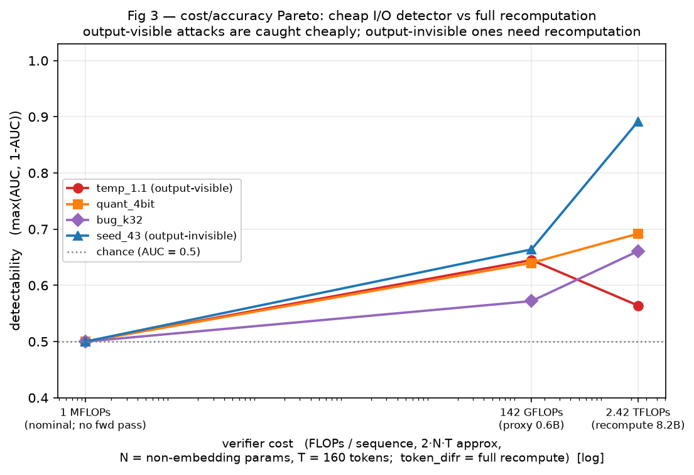

# Inference Verification Gym (`ivgym`)

**Infrastructure for the inference-verification game.** `ivgym` is a
standardized environment where a cheating **provider** (an *attack* — a way of
deviating from a sampling specification) is pitted against a **verifier** (a
*defense* — a per-token divergence score), and the gym reports how reliably the
deviation is caught (detection AUC). Attacks and defenses are pluggable
registries; the `generate → verify → calibrate → evaluate` loop and the backend
are the fixed infrastructure underneath.

The methodology follows *DiFR: Inference Verification Despite Nondeterminism*
(Karvonen et al., 2025) — drop in **a new attack** or **a new defense** and
immediately get detection-AUC curves against everything else.

It runs on **a real model on a GPU** via the HuggingFace backend
(`ivgym/backends/hf_gpu.py`), validated on an NVIDIA H100-80GB with
`Qwen/Qwen3-0.6B`. The attack/defense/harness/metrics core is pure numpy and
backend-agnostic; a documented **vLLM adapter** sketches the higher-throughput
production path.

## The game, as infrastructure

The verification game is a hypothesis test between two parties who agree on a
sampling spec ϕ. The **provider (attacker)** emits `(input, output)` pairs
*claiming* it ran ϕ on the reference model, but may secretly deviate (cheaper
quantized weights, wrong seed/temperature, a sampler bug, or exfiltrated
weights). The **verifier (defender)** recomputes under ϕ — it never sees the
attack — scores each claimed token for divergence, aggregates those scores into
a batch statistic `S`, and flags the batch when `S > τ`. The **defender wins**
when it flags a deviating provider while keeping the honest false-positive rate
under budget (AUC → 1 / high TPR@FPR); the **attacker wins** when it deviates
yet keeps `S` indistinguishable from honest (AUC ≈ 0.5).

DiFR specifies a score for a *single token*; the **aggregation across tokens**
and the **classification rule** are `ivgym`'s own (specified, not implicit):
per-token scores are winsorized at the 99.9th honest percentile, a batch of `b`
tokens is averaged into `S` (`harness.batch_means`), and the decision is
`S > τ` with **τ fixed by a target false-positive rate** (the `(1−α)` honest
quantile, `metrics.tpr_at_fpr`). See **[docs/GAME.md](docs/GAME.md)** for the
full formalization — players, win conditions, the exact per-token→batch→decide
pipeline, and how this relates to the stego paper's `SAFE`-set security game.
Two worked *attacker wins* (AUC ≈ 0.5) ship as pluggable example strategies — a
SAFE-set substitution against the seed-synced verifier
([`examples/safe_set_strategies.py`](examples/safe_set_strategies.py)) and a
quantize+temp-retune compute cheat against the seed-free verifier
([`examples/seed_free_strategies.py`](examples/seed_free_strategies.py)) — run
either against the built-in defenses with `experiments/run.py --strategies`.

`ivgym` makes the three axes of that game into pluggable registries and holds
everything else fixed:

| Axis        | Built-in instances                                       | Where |
|-------------|----------------------------------------------------------|------|
| **Attack** (provider deviation) | 4-bit quant, fp8 KV cache, wrong temp/seed, sampling bug, adversarial-temp | `ivgym/attacks.py` |
| **Defense** (verifier score)    | Token-DiFR margin (+clipped/likelihood), cross-entropy, Activation-DiFR, TOPLOC | `ivgym/defenses.py` |
| **Backend** (the arena)         | **real HF GPU** (transformers); vLLM sketched            | `ivgym/backends/` |

So the framework makes those three axes pluggable registries and keeps the
generate → verify → calibrate → evaluate loop fixed.

## Layout

```
ivgym/
  sampling.py            seed-synced Gumbel-Max + top-k/top-p (Alg. 1)
  core.py                SamplingSpec, Sequence/TokenStep, VerifyContext
  attacks.py             Attack base + registry (honest, quant, temp, seed, bug, adv-temp)
  defenses.py            Defense base + registry (token_difr, cross_entropy, activation_difr)
                         -- white-box: handed ref_logits (verifier re-ran model M)
  io_detectors.py        IODetector base + registry (surface_stat/rank/tokens, learned, llm_judge)
                         -- black-box: score (prompt, claimed_tokens) WITHOUT recomputing M
  metrics.py             ROC AUC + TPR@FPR in pure numpy
  harness.py             generate_dataset / verify / winsorize / batch_means / evaluate
  backends/
    base.py              Backend protocol
    hf_gpu.py            REAL model on a GPU (transformers) — the arena
    vllm_adapter.py      contract + skeleton for the vLLM production path
experiments/
  run.py                    pluggable CLI: --strategies <file> --attacks/--defenses (no edits)
  exp_gpu.py                attack × defense AUC grid on a real model (Table 2 / Fig. 1 shape)
  exp_io_detector_gpu.py    black-box I/O detectors vs recomputation, incl. the LLM judge
  exp_family_correlation.py within-family proxy↔M agreement = the exact spec-decoding accept rate (1−TV)
  exp_cross_family_accept.py cross-family accept rate (shared Qwen tokenizer): high within family, falls with family distance
  exp_detectability_vs_kl.py proxy detectability is bounded by KL(M‖proxy) — the accept-rate budget
examples/
  custom_strategies.py      template: a custom attack + a custom defense
  safe_set_strategies.py    seed-aware SAFE-set substitution attack
  seed_free_strategies.py   quant + temp-retune + fingerprint-spoof attack
tests/test_smoke.py         backend-agnostic unit tests (sampling, projection, metrics, registry)
```

## Run it

On a CUDA host (validated: single H100-80GB, torch 2.8.0+cu128, transformers 5.x).
`torch` is the only heavy dependency; reuse a system install if present.

```bash
# from inference-verification/
python -m venv --system-site-packages .venv     # reuse system torch if available
.venv/bin/pip install "transformers>=4.44" accelerate safetensors
.venv/bin/python -m experiments.exp_gpu          # downloads Qwen/Qwen3-0.6B on first run (~3 min at defaults)
.venv/bin/python tests/test_smoke.py             # backend-agnostic sanity checks (no GPU needed)

# headline numbers below use a larger token pool for clean AUCs (~13 min on an H100):
IVGYM_PROMPTS=20 IVGYM_TOKENS=128 IVGYM_BATCH=1000 .venv/bin/python -m experiments.exp_gpu
```

Override with env vars: `IVGYM_MODEL`, `IVGYM_PROMPTS`, `IVGYM_TOKENS`, `IVGYM_BATCH`.

Real-model output (Qwen3-0.6B, 20 prompts × 128 tokens, batch=1000, ~13.5 min on an H100-80GB):

```
      attack |       token_difr    cross_entropy  activation_difr
  quant_4bit |           1.0000           0.9186           1.0000
      kv_fp8 |           1.0000           0.9931           1.0000
    temp_1.1 |           1.0000           1.0000           0.0000
     seed_43 |           1.0000           1.0000           0.0000
      bug_k2 |           1.0000           0.1347           0.0000
     bug_k32 |           1.0000           0.9791           0.0000
```

Over a real LLM's logit geometry, with a large enough token pool the picture is crisp:

- **Token-DiFR** catches *every* attack (AUC 1.0 across the board) — the strong,
  general detector that sees both forward-pass and sampling deviations.
- **Activation-DiFR** is perfectly bifurcated: 1.0 on forward-pass attacks
  (quant/fp8) and 0.0 on every sampling-only change (temp/seed/bug) — it never
  sees the sampler.
- **Cross-entropy** flags almost everything (0.92–1.0) but is blinded by the tiny
  `bug_k2` (1%-rate flip of the top-2 tokens, AUC 0.13) — the hard case, where
  only Token-DiFR still holds at 1.0.

At the smaller default pool (12 prompts × 48 tokens, batch=200, ~3 min) the same
structure is visible but noisier — several AUCs sit near or below 0.5. Push
`IVGYM_PROMPTS` / `IVGYM_TOKENS` / `IVGYM_BATCH` up to sharpen them, exactly as
the paper's batch-size sweep predicts.

How attacks map onto the real model: temperature/seed are real `SamplingSpec`
changes and the sampling bug really hijacks the sampler; the forward-pass attacks
(quant/fp8) apply their logit/activation perturbation on top of the real Qwen3
logits. See `ivgym/backends/hf_gpu.py` for the full contract.

## Black-box detectors: validating *that recomputation is necessary*

All the defenses above are **white-box / recomputation** detectors: the verifier
re-runs the reference model `M` and is handed `ref_logits`. `ivgym/io_detectors.py`
adds the **black-box / input-output** analogue — an `IODetector` scores
`(prompt, claimed_tokens)` **without recomputing `M`** (it may call a *cheap,
different* proxy model, never `M`'s own forward pass). This ports the white-box vs
black-box detector split from Clymer et al., *Lessons from building a model-organism
testbed* (2025): a black-box predictor is used as a **validator of white-box-ness** —
if outputs alone can't tell an attack from honest while recomputation nails it, the
recomputation defense is providing genuine information beyond behaviour.

`experiments/exp_io_detector_gpu.py` runs this on the real model. The cheap I/O
detectors (`surface_stat`/`surface_rank` read a cheap proxy over M's real logits;
`surface_tokens` uses no model at all) and the **`llm_judge`** — a zero-shot Claude
judge over `(prompt, decoded continuation)`, which only runs on a real-text backend
— all score the same sequences `token_difr` recomputes. The judge's key resolves from
`ANTHROPIC_API_KEY`, the repo `.claude/`, or `~/.claude/anthropic_key.sh`.

```bash
.venv/bin/pip install anthropic                # needed only for the llm_judge
# headline (~21 min on an H100; ~160 prompts judged by Claude):
IVGYM_PROMPTS=20 IVGYM_TOKENS=128 IVGYM_BATCH=200 \
    .venv/bin/python -m experiments.exp_io_detector_gpu
# set IVGYM_JUDGE=0 to skip the API calls (cheap I/O detectors only)
```

Detectability = `max(AUC, 1-AUC)` (a black-box signal that *reverses* under an
attack still separates it); compare every cell to the honest-null floor (a second
independent honest draw from the same `M`). Real-model output (Qwen3-0.6B, 20×128
tok, batch=200; full log in `docs/results/exp_io_detector_gpu_qwen3-0.6b.txt`):

```
          attack |  token_difr |   surface_stat   surface_rank surface_tokens      llm_judge
   (honest null) |       0.523 |          0.530          0.650          1.000          0.989    <- floor
      quant_4bit |       0.808 |          0.662          0.651          0.717          1.000
          kv_fp8 |       0.629 |          0.675          0.768          0.530          0.552
        temp_1.1 |       0.558 |          0.650          0.756          0.575          1.000
         seed_43 |       1.000 |          0.784          0.737          0.757          0.511
          bug_k2 |       0.670 |          0.823          0.657          0.556          0.786
         bug_k32 |       0.941 |          0.739          0.730          0.603          1.000
```

- **Role 2 (headline).** **`seed_43` is RECOMPUTE-DOMINANT** — `token_difr` = 1.000
  while the Claude judge sits at its honest-null floor (0.511, i.e. *below* the 0.989
  floor → no signal). A wrong sampling seed redraws the *same* distribution, so the
  continuation reads as a perfectly honest sample to any reader of the outputs, yet a
  re-run flips the Gumbel winners. `quant_4bit` and `bug_k32` are RECOMPUTE-DOMINANT
  too. That gap is a quantitative proof the deviation is invisible in the outputs.
- **Honest caveat.** A *high* I/O-AUC (e.g. `temp_1.1`) is **not** a verifier win —
  it means the attack is crude enough to catch from outputs alone (a statement about
  the *attack*, not the verifier).
- **Read per-sequence-constant detectors via excess over their own floor**, not the
  absolute cell: `llm_judge` and `surface_tokens` emit one value per sequence broadcast
  to its tokens, so a token-batch mean over only ~20 sequences inflates their null floor
  toward 1.0 (a documented finite-pool artifact). The experiment's dominance synthesis
  compares each detector against its own floor for exactly this reason.



## Add your own attack / defense (no edits to the library)

Write a file that registers your strategies and point the runner at it with
`--strategies`. Nothing in `ivgym/` is touched — importing your file runs the
`@register` decorators, which add the strategies to the same registries the
harness and every backend already use. A complete, runnable template lives in
[`examples/custom_strategies.py`](examples/custom_strategies.py).

A new **attack** (provider deviation). Subclass `Attack` and override any of the
hooks; the `@dataclass` form lets you parametrize it:

```python
from dataclasses import dataclass
from ivgym.attacks import Attack, register

@register
@dataclass
class MyAttack(Attack):
    name: str = "my_attack"
    def provider_spec(self, ref):               # change sampling params, or
        return ref.replace(temperature=0.8)
    def logit_bias_sigma(self):                 # perturb the forward pass, or
        return 0.3, 0.1
    def sample_override(self, rng, top_k_ids):  # hijack the sampler
        return None
```

A new **defense** (verifier score, higher = more divergent from reference):

```python
from dataclasses import dataclass
from ivgym.defenses import Defense, register

@register
@dataclass
class MyDefense(Defense):
    name: str = "my_defense"
    needs_seed: bool = True          # needs shared Gumbel noise?
    needs_activation: bool = False   # needs activation fingerprints?
    def score(self, ctx):
        ...
```

`@register` accepts either a class (instantiated with its defaults, as above) or
a pre-built instance, e.g. `register(MyAttack(name="my_attack_hot", temp=1.3))`.

Then run the sweep — your strategies are scored against everything else, on the
real model, with no other changes:

```bash
# list everything that is registered (built-ins + your file)
.venv/bin/python -m experiments.run --strategies examples/custom_strategies.py --list

# full sweep including your strategies (default backend: hf_gpu, Qwen/Qwen3-0.6B)
.venv/bin/python -m experiments.run --strategies examples/custom_strategies.py

# pick the matchups and the batch size
.venv/bin/python -m experiments.run --strategies examples/custom_strategies.py \
    --attacks logit_spike quant_4bit --defenses token_difr cross_entropy topk_overlap
```

`experiments/run.py --help` lists every flag (`--model`, `--prompts`, `--tokens`,
`--batch`, `--n-batches`, `--backend`).

## Moving to real models

The HF GPU backend (`ivgym/backends/hf_gpu.py`) already runs the harness against a
real model — start there. For the higher-throughput **vLLM** production path,
implement the three methods in `ivgym/backends/vllm_adapter.py` on a CUDA host.
Attacks map to real vLLM config (`quantization=...`, `kv_cache_dtype="fp8"`,
`SamplingParams(temperature=, seed=)`); the verifier does one prefill pass over
`prompt + claimed_tokens` and reads logits/activations. Defenses and the harness
need no changes. See the module docstring for the full contract.

## Status / not yet done

- TOPLOC baseline defense (top-k index/value polynomial) — stub slot in defenses.
- Likelihood-style Token-DiFR transforms (Appendix A) and multi-feature
  aggregation (the paper monitors several detectors in parallel).
- Communication-cost Pareto sweep for Activation-DiFR vs TOPLOC (k × J).
- Real vLLM backend implementation + the temp-0 spot-check mode (Appendix D).
  (The HF GPU backend in `ivgym/backends/hf_gpu.py` now runs the harness against a
  real model end-to-end; vLLM remains for higher throughput.)
- `LLMJudgeIODetector` runs only on a real-text backend (`hf_gpu`). It is now
  exercised end-to-end by `experiments/exp_io_detector_gpu.py` on real Qwen3-0.6B
  continuations (key resolves from `ANTHROPIC_API_KEY` / repo `.claude/` /
  `~/.claude/anthropic_key.sh`); it is still not run in CI (no GPU / no key there).
- I/O detectors are not yet wired into `experiments/run.py` (a `--io-detectors` flag);
  they run via the standalone `experiments/exp_io_detector_gpu.py`.
