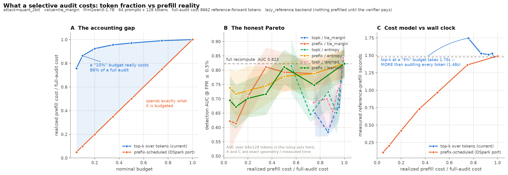
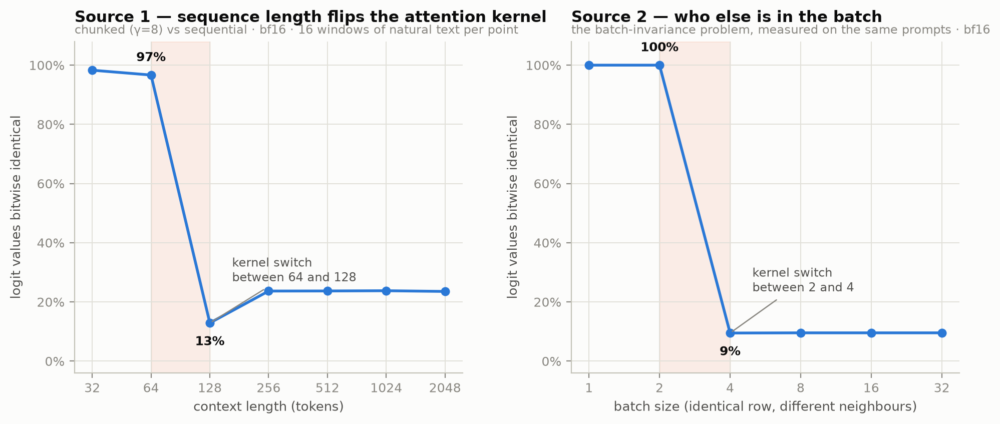
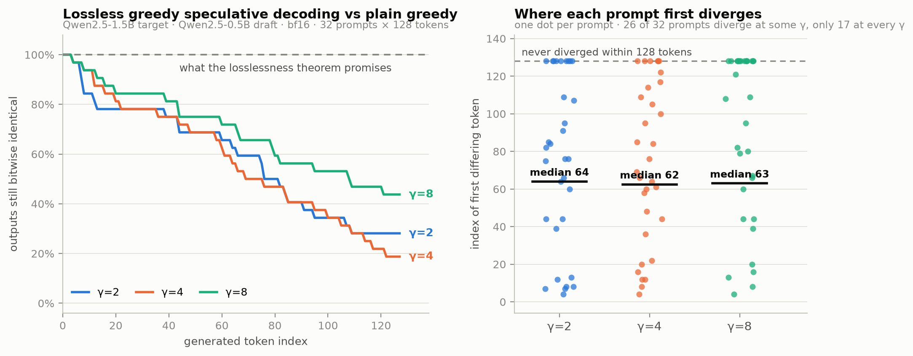

# Inference Verification Gym (`ivgym`)

**Can a client check that an inference provider ran the model it charged for?**

You rent inference. The provider promises a specific model under specific
sampling settings and bills you accordingly. Nothing stops it from quietly
serving a 4-bit copy, a smaller model, or a different sampler and pocketing the
difference. `ivgym` is a testbed that pits provider-side deviations (*attacks*)
against verifier-side detectors, on real models on a GPU, under one fixed
evaluation protocol — so "who catches whom" is a grid rather than an anecdote.

The full write-up is **[`paper/paper.pdf`](paper/paper.pdf)**. Every table and
figure in it regenerates from the committed run artifacts
(`python paper/make_tables.py && python paper/make_figs.py`, byte-identical).

---

## The short version

**Three findings organize everything else.**

1. **Recomputation works, but barely, and at a price.** Re-running the reference
   model `M` and comparing per-token sampling margins catches every deviation we
   tried *on some model*, but no single detector is reliable across model
   families, and the per-token signal from realistic quantization is so weak
   (d′ ≈ 0.07) that thousands of tokens must be pooled before a verdict is
   trustworthy.
2. **The cheap tiers fail in one predictable place.** A client-side proxy catches
   wholesale model substitution at **AUC 0.998** without ever running `M` — but is
   blind to quantization, because quantization moves the served distribution less
   than `M`'s own run-to-run nondeterminism. *Deviations that change what the
   model can do are cheap to catch; deviations that change only how precisely it
   does it are not.*
3. **The dominant error here is statistical, not cryptographic.** Resampling
   evaluation batches from too small a token pool inflates detection AUC without
   bound. The same measurement reads **0.977 and 0.530** depending only on pool
   size. This is now enforced in code (`EvalConfig.max_pool_ratio`) rather than
   left to the reader.

---

## Quickstart

```bash
python -m venv --system-site-packages .venv         # reuse system torch if present
.venv/bin/pip install -r requirements.txt

.venv/bin/python tests/test_smoke.py                # 18 tests, numpy only, no GPU
.venv/bin/python tests/test_claims.py               # every claim still has its evidence
.venv/bin/python -m experiments.exp_gpu             # ~3 min, downloads Qwen3-0.6B
```

`exp_gpu` prints the real-model grid **and the ratio it was measured at**, then
tells you what that pool can and cannot resolve:

```
Real-model detection AUC @ FPR<=0.5%   (batch=28 tokens, honest eval pool=288, batch/pool=9.7%)
      attack |       token_difr    cross_entropy  activation_difr     token_toploc
----------------------------------------------------------------------------------
  quant_4bit |           0.5290           0.5000           1.0000           0.5001
      kv_fp8 |           0.5034           0.5050           1.0000           0.5002
    temp_1.1 |           0.5139           0.5097           0.4995           0.5068
     seed_43 |           0.9773           0.5050           0.4987           0.5062
      bug_k2 |           0.4987           0.5016           0.5014           0.4987
     bug_k32 |           0.5125           0.5024           0.5002           0.5003

Per-token effect size d'  /  batch it nominates for AUC 0.90 (pool-independent)
      attack |       token_difr    cross_entropy  activation_difr     token_toploc
----------------------------------------------------------------------------------
  quant_4bit |   +0.037 / 10273      -0.030 / --       +3.986 / 1    +0.064 / 3445
      kv_fp8 |      -0.000 / --    +0.066 / 3232       +3.086 / 2    +0.078 / 2316
     seed_43 |      +0.781 / 24    +0.071 / 2855      -0.153 / --     +0.152 / 612
      ...
```

Read the two tables together. A 3-minute pool resolves exactly two things —
`activation_difr` on forward-pass attacks (d′ ≈ 4, needs a batch of 1) and
`seed_43` under `token_difr` (d′ = 0.78, needs 24) — and it says so. Everything
else sits at chance *and reports the batch it would need*. **Growing the batch on
this pool buys ratio, not evidence.** Grow `IVGYM_PROMPTS`/`IVGYM_TOKENS`.

---

## The evaluation protocol

Everything is scored under one `harness.EvalConfig`, so no experiment picks its
own settings.

| knob | value | why |
|---|---|---|
| metric | **standardized partial AUC @ FPR ≤ 0.5%** | A provider is checked continuously, so it cannot tolerate more than a sliver of false accusations. McClish-standardized, so 0.5 = chance and 1.0 = perfect, same scale as full AUC. Consistently *stricter*. |
| threshold | `(1−α)` quantile of a **held-out** honest calibration split | out-of-sample, never the batches TPR is measured on |
| winsorization | 99.9th pct of the honest calibration split | one outlier cannot carry a batch |
| **batch/pool ratio** | **≤ 10%, enforced** | see below |

### The batch/pool ceiling

The batch statistic is a mean of `b` tokens drawn *without replacement from a
fixed token pool*. As `b` approaches the pool size every batch mean converges to
the pool mean and the honest variance collapses. The AUC then no longer answers
"would a fresh batch be flagged?" — it answers "do these two particular pools have
different means?", which is nearly deterministic. Holding the model, the attack
and the per-token scores fixed and growing only the pool:

| honest pool (tokens) | batch/pool | AUC @ FPR ≤ 0.5% |
|---:|---:|---|
| 576 | 69.4% | 0.977 ± 0.010 |
| 1 152 | 34.7% | 0.577 ± 0.042 |
| 2 304 | 17.4% | 0.679 ± 0.099 |
| 4 608 | 8.7% | 0.523 ± 0.021 |
| 22 464 | 1.8% | 0.530 ± 0.011 |

0.977 and 0.530 are the **same measurement**. Note it is not monotone: at 17.4%
it bounces back to 0.679 with a ±0.099 spread. Over-ratio measurements are not
conservatively biased, they are *erratic* — and the artifact has **no sign**,
which is why it cannot be spotted from a single table.

So it is a correctness condition, and the library treats it as one:

```python
harness.evaluate(honest, attack, verifiers, [1500])
# RatioCeilingWarning: batch/pool ratio 75.0% exceeds the 10% ceiling ...
#   Grow the pool to >= 15000 eval tokens, or shrink the batch. To measure the
#   inflated arm on purpose, pass EvalConfig(over_ratio='allow').

harness.EvalConfig(over_ratio="raise")   # hard failure
harness.EvalConfig(over_ratio="allow")   # deliberate: exp_headline_ratio_gpu et al.
```

Every `EvalResult` carries `.pool_ratio`, `.eval_pool` and `.over_ceiling`, so a
number can never travel without the ratio that makes it interpretable.

### The pool-independent statement

`d′ = (E[s | deviating] − E[s | honest]) / sd(s | honest)`. A batch of `b`
independent tokens separates by `d′√b`, so `d′` says how big a pool a verdict
needs *before any GPU time is spent* (`ivgym/signal.py`). On a 56 160-token pool —
large enough to test the prediction for the first time — it holds to within
0.03 AUC:

| batch | ratio | measured | predicted from d′ = 0.0775 alone |
|---:|---:|---|---|
| 400 | 1.4% | 0.559 ± .010 | 0.548 |
| 800 | 2.8% | 0.627 ± .015 | 0.625 |
| 1 600 | 5.7% | 0.781 ± .023 | 0.790 |
| **2 361** | 8.4% | **0.873 ± .008** | **0.900** ← the batch d′ nominates for 0.90 |

Across the five points inside the ceiling the mean absolute residual is 0.012.
The residual is signed the way theory says it should be: the prediction treats
the `b` tokens in a batch as independent and tokens inside a sequence are not, so
it is mildly optimistic exactly where the curve is steep.

**Deployment consequence.** A 4-bit quantization of a 1.7B model is detectable —
but the verifier needs ~10³ tokens pooled into each verdict and 10⁴–10⁵ honest
tokens to calibrate against. Any protocol promising a verdict on a single
completion is not, on this evidence, measuring quantization.

---

## What catches what

Eight verifiers, each mapping to a claim the report stands behind. Tier-1
recomputes `M`; Tier-0 never does.

| tier | verifier | what it sees | structural blind spot |
|---|---|---|---|
| 1 | `token_difr` | post-Gumbel margin — forward pass **and** draw | nothing, but the margin under `kv_fp8` is reliably positive and reliably tiny (d′ = 0.015) |
| 1 | `token_toploc` | rank of the claimed token in the filtered distribution | `bug_k2`. **Needs no seed synchronization** — a much weaker deployment requirement |
| 1 | `cross_entropy` | NLL of the claimed token | anything that doesn't move the bulk of the distribution (`bug_k2`) |
| 1 | `activation_difr` | L2 on projected activations | **the sampler, exactly and by construction** — activations are computed before a token is drawn |
| 0 | `accept_rate` | `1 − TV(p, q)` against a client-owned proxy | quantization (see the KL budget below) |
| 0 | `surface_stat` / `surface_rank` | proxy surprisal / rank | same |
| 0 | `surface_tokens` | token-id statistics, no model at all | almost everything; it is the zero-FLOP floor |
| 0 | `llm_judge` | a zero-shot judge reading the continuation | anything output-indistinguishable |

The headline grid at a **legitimate 8.9% ratio** (Qwen3-0.6B, 22 464-token pool,
batch 1000, 5 protocol seeds — `exp_headline_ratio_gpu`):

```
      attack |       token_difr    cross_entropy  activation_difr     token_toploc
  quant_4bit |            0.718            0.505            1.000            0.600
      kv_fp8 |            0.511            0.507            1.000            0.517
    temp_1.1 |            0.516            0.823            0.504            0.661
     seed_43 |            1.000            0.524            0.575            0.507
      bug_k2 |            0.553            0.510            0.499            0.523
     bug_k32 |            0.712            0.605            0.499            0.686
```

Re-measured from the *same per-token scores* as the previously-published 78%-ratio
table, **16 of 24 cells fall**, by a median of 0.137 and by as much as 0.463. The
winning detector per attack is unchanged in all six rows, so the portfolio
recommendation survives — what changes is how good the winner is.

Two cells settle that the valid arm is the *correct* one, not merely the
pessimistic one: under `seed_43` the provider redraws from **exactly** the honest
distribution, so a detector that only reads where the claimed token sits has
mechanistically nothing to see. At 78% `cross_entropy` read 0.987 and
`token_toploc` 0.828 — near-perfect detection of a deviation neither can in
principle observe. At 8.9% they read 0.524 and 0.507. The inflated arm did not
exaggerate a real signal, it **manufactured** one.

**Use a portfolio, not the best detector.** Each score is structurally blind to a
different class of deviation, and which one wins is set by the attack, not the
model. That argument rests on the mechanism above — not on the "detector
reversals" the earlier record reported, which
[do not exist](docs/results/reversal_check.json): re-measured, all five cells
have d′ > 0. `token_difr` does not invert on SmolLM2 or Pythia; it is simply *at
chance* there, because an fp8 KV cache at 8 192 tokens is below its detection
floor.

---

## The cheap tier: where a proxy wins, and exactly where it stops

The client holds its own small proxy `q` (sharing `M`'s tokenizer) and computes
the rate at which `q`'s drafts would be accepted against the served distribution
`p`. That rate is exactly an overlap:

```
accept = E_{x~q}[min(1, p(x)/q(x))] = Σ_x min(p(x), q(x)) = 1 − TV(p, q)
```

The client **owns** `q`, so `q` is a trusted anchor even though `p` is not.

- **It wins outright on substitution.** A provider paid for Qwen3-4B that secretly
  serves Qwen3-0.6B is caught at **AUC 0.998** (honest accept 0.776 vs 0.700),
  using a trusted 1.7B draft and **never running `M`** — at 2.3× fewer FLOPs than
  recomputation. `exp_spec_substitution_gpu`
- **It survives the standard evasion.** A provider that quantizes then retunes
  temperature to restore honest *entropy* blinds an entropy fingerprint
  (1.00 → 0.59) but cannot re-enter the honest acceptance band, because matching
  entropy does not restore `TV(p̂, q)`.
- **It is blind to realistic quantization**, and this is not a tuning failure. The
  expected proxy surprisal on honest text is `H(M,q) = H(M) + KL(M‖q)`, so
  **`KL(M‖q)` is the entire signal available to any proxy detector**.
  `exp_detectability_vs_kl`

A cheap proxy shrinks how often the exact recomputation must fire. It does not
replace it. The same wall shows up from three independent directions —
the acceptance rate, the recompute detectors on `kv_fp8`, and the selective-audit
Pareto — which is the strongest form the claim takes.

**Validating that recomputation is necessary at all.** `exp_io_detector_gpu` runs
black-box detectors, including a zero-shot Claude judge, against the same
sequences. The clean case is a wrong seed: `token_difr` scores 1.000 while the
judge sits at its own honest-null floor (0.511 against a floor of 0.989 — *no
signal*). Re-seeding redraws from the same distribution, so the continuation
reads as a perfectly ordinary sample to any reader of the text, while a re-run
flips which Gumbel candidate won. That gap is a quantitative proof the deviation
is invisible in the outputs. The converse matters too: a *high* black-box AUC is
not a verifier win, it is a statement that the attack was crude.

---

## What a selective audit really costs

If a full audit is too expensive, audit some tokens — and report the fraction
audited as the cost. **It is not the cost, and the gap inverts conclusions.**

Reading `M`'s logits at generated position `j` requires a prefill over
`prompt + claimed[:j]`. So a sequence's audit cost is set by its *deepest* audited
position, and any sequence touched at all re-pays for its prompt. A global top-`k`
rule scatters its audit across essentially every sequence. Measured on a backend
instrumented to prefill lazily and refuse to serve an unpaid row:

| nominal budget | top-`k` realized | seconds | prefix schedule | seconds |
|---:|---:|---:|---:|---:|
| 5% | **75.8%** | **1.75** | 5.0% | **0.11** |
| 10% | 86.4% | 1.53 | 10.0% | 0.21 |
| 100% | 100% | 1.48 | 100% | 1.49 |

**A "5%" top-`k` audit takes 1.75 s; auditing every single token takes 1.48.** The
reported saving was overstated by up to 15×. The fix is a scheduler that admits
contiguous per-sequence prefixes greedily by value per unit of *marginal* cost —
depth is cheap, breadth is expensive — which spends exactly its budget and runs
**16× faster**. `harness.select_prefix_scheduled`, `verify(..., scheduler="prefix")`

This replicates across attacks *because it contains no statistics*: at a nominal
5% budget top-k realizes 75–77% on every attack and the prefix schedule realizes
5.0% on every attack. Re-running it against a different deviation is a null
experiment by construction, and it comes back null.



---

## The honest null is not one thing: the forward-pass shape moves the logits

Every AUC above is measured against an honest null of *the same model, on the same
H100, run twice*. That null is exactly reproducible — a rerun at a fixed shape is
**bitwise identical**, at every dtype and every speculation depth, `max |Δ logit|
= 0.0`. A deployed verifier does not get that null. It recomputes `M` in whatever
shape its own stack picks, against tokens a provider produced in another.

Holding the weights, the prefix and the arithmetic fixed and changing *only* how
the forward pass is scheduled (`exp_specdec_shape_gpu`, Qwen2.5-1.5B, bf16):

| what changed | logit values bitwise identical | max \|Δ logit\| |
|---|---:|---:|
| nothing — rerun, same shape | **100%** | **0.0** |
| chunked verify vs sequential decode, γ=8, ~35-tok prompts | 97.1% | 0.594 |
| the same, on ~190-tok prompt+completion sequences | 13.6% | 0.844 |
| batch of 4 instead of batch of 1, same row, same neighbours-blind attention | 9.5% | 0.906 |

Two knobs flip it, and each flips it as a **step, not a trend**: sequence length
between 64 and 128 tokens, and batch size between 2 and 4 (`exp_specdec_ctxlen_gpu`,
97% → 13% across one doubling, then flat out to 2 048 tokens). That is discrete
kernel selection — a different tiling or split-K decomposition, so a different
reduction order — not error accumulating with depth.



In tokens: **0.88% of generated positions change their argmax** under the chunked
shape and 0.73% under a batch of 8, against 0.00% for a rerun
(`exp_specdec_fliprate_gpu`, 3 968 real decode positions). The mechanism is
visible in the margins — 23.4% of those positions have a top-1-minus-top-2 gap
smaller than the 0.84 perturbation, so for a quarter of all tokens the last bit
decides the token.

The end-to-end consequence is the cleanest statement of it. Greedy speculative
decoding is *provably* output-identical to greedy decoding — a draft token is
accepted iff it equals the target's argmax. Run both on real models
(`exp_specdec_divergence_gpu`, Qwen2.5-1.5B target, Qwen2.5-0.5B draft): **26 of
32 prompts diverge within 128 tokens**, at a median index of ~63. The proof is not
wrong; its premise is. It assumes the target's argmax is the same quantity whether
the target scores one token or a block of γ at once, and the block is a chunked
pass.



**What this does and does not say.** It is not an attack and it is not scored as
one: no AUC in this repo is re-measured against it, and 0.88% is *not* a `d′` —
the Tier-1 detectors read margins and NLL, not token equality, so the two numbers
are not on the same scale. What it bounds is the **benign** floor: a verifier that
compares tokens against a local recompute will see this rate from an honest
provider running exactly the algorithm it promised. Converting it to `d′` on
`evaluate`'s scale, so it can be put beside `quant_4bit`'s 0.0775, is the missing
step and the first item in
[`NEXT_EXPERIMENTS.md`](NEXT_EXPERIMENTS.md) — of which this is the single-GPU
half, now run.

---

## Two things that did not transfer (kept, because the pattern is the result)

Given a budget, where should it go? Two principled answers were implemented and
both lost to a one-line heuristic.

- **A learned, calibrated per-token value head** (DSpark port, `ivgym/triage.py`).
  Nine cheap proxy features, BCE-trained on per-token *sensitivity* using honest
  data only, then temperature-scaled. It does not beat `entropy`, the hand-written
  signal already in the library, either as a ranking key or as the value term
  inside the scheduler. Its calibration stage is near-identity (fitted temperature
  0.975; held-out ECE gets *worse*, 0.0190 → 0.0246). The informative part is what
  it learned: largest positive weights on tie-ness (+0.86) and proxy surprisal
  (+0.80), and a **negative** weight on entropy (−0.28) — while `entropy` is the
  best allocator in the table. It is not failing to fit; it is fitting the wrong
  target.
- **The correct target, derived — and it still loses** (`ivgym/infogain.py`). For a
  weighted centered batch statistic, detection power is `δ²(A) = (b/n) Σ_{t∈A} I(t)`
  with `I(t) = Δ(t)²/v(t)`. Sensitivity is the numerator only; a near-tie position
  is sensitive *and* noisy. The theory also names the optimal aggregator: the
  matched filter `w = Δ/v`. Measured at full scale, the matched filter is **below
  the plain mean at every budget** (−0.078 ± .008 at a 5% budget, t = −10.4), and
  substituting **oracle** weights read off labelled pairs does not rescue it
  (−0.142 ± .024). Why: fitting the same features on labelled pairs predicts log
  honest variance well (R² = 0.73) and the signal not at all (R² = 0.002), so
  `I = Δ²/v` divides a quantity the features cannot estimate by one they can, and
  the resulting estimate is **anti-correlated** with the truth (Spearman −0.92).

**The pattern.** The prefix scheduler is a statement about prefill geometry: it
holds for every value signal, contains no statistics, and delivers 16×. The head
and the matched filter are statements about *where the evidence is*, and both
fail. In selective verification, **the cost side transfers and the signal side
does not** — so the engineering worth doing is on the accounting, not the
estimator. Anyone porting speculative-decoding machinery into a verification
setting should take the scheduler and skip the head.

---

## What we would actually deploy

1. **Cascade, cheap tier first, for the right reason.** A client-side proxy
   catches capability downgrades — the attacks with real money in them — at a
   small fraction of one forward pass. Use it as a continuous first-line filter,
   not as a verifier.
2. **Keep recomputation for what only recomputation can see.** Quantization, fp8
   caches and sampler deviations are recompute-dominant. Spot-check with it rather
   than running it continuously.
3. **Use a portfolio of detectors.** `token_toploc` deserves particular attention:
   it needs no seed synchronization.
4. **Budget in prefill tokens, and schedule prefixes.** Depth is cheap, breadth is
   expensive.
5. **Spend the tuning effort on pool size, not the estimator.** Every attempt to be
   cleverer than a plain mean failed. Measure `d′` on a few thousand tokens first;
   it tells you the pool the verdict will require.
6. **Report the batch/pool ratio next to every AUC.** It is one number, and without
   it a detection AUC is not interpretable.

---

## Layout

```
ivgym/
  core.py            SamplingSpec, Sequence/TokenStep, VContext
  sampling.py        seed-synced Gumbel-Max + top-k/top-p
  attacks.py         Attack base + registry (honest, quant, kv_fp8, temp, seed, bug, adv-temp)
  verifiers.py       ONE abstraction for every detector: (value, evidence, aggregation)
                     under a recompute budget. Tier-1 recomputes M; Tier-0 never does.
  harness.py         generate -> verify -> calibrate -> evaluate, and EvalConfig: the one
                     standardized protocol every experiment scores under, INCLUDING the
                     enforced batch/pool ceiling
                     + prefill_cost / select_prefix_scheduled: the PHYSICAL audit cost
  metrics.py         ROC AUC, TPR@FPR, standardized partial AUC. Pure numpy.
  signal.py          the theory side: d' -> batch separation -> predicted pAUC, so an
                     experiment can PREDICT a detection AUC instead of only measuring one
  spec_decode.py     the acceptance-rate identity 1-TV(p,q), ProxyReference anchor
  triage.py          NEGATIVE RESULT: the learned confidence head (DSpark port)
  infogain.py        NEGATIVE RESULT: the derived matched filter, with oracle arms
  model_taxonomy.py  model-relationship axes + a distance() derived from them
  model_registry.py  one ModelIdentity per HF id
  backends/hf_gpu.py a real model on a GPU + lazy_reference: RAISE on an unpaid
                     reference row, so a selective budget's cost is MEASURED not assumed

experiments/         one file per claim; exp_*_gpu.py need CUDA, plot_*.py do not
  specdec_common.py  the two forward-pass SHAPES (sequential vs chunked/batched) as
                     one symmetric API, shared by the four exp_specdec_* experiments.
                     Torch, so it lives here rather than in the numpy-only core
  data/              inputs the specdec experiments were measured on: the 32-prompt
                     bank and the long natural document for the context sweep
tests/               test_smoke / test_proxy_spec / test_triage_and_cost / test_infogain
                     + test_claims.py: every claim still has the artifact it came from
paper/               paper.tex + make_tables.py + make_figs.py (regenerate from docs/results/)
docs/results/        every committed run artifact; docs/figures/ every committed figure
```

### Which experiment backs which claim

| claim | experiment | artifact |
|---|---|---|
| the ratio artifact | `exp_baseline_headroom_gpu` | `baseline_headroom.json` |
| the headline grid, re-measured inside the ceiling | `exp_headline_ratio_gpu` | `headline_ratio.json` |
| d′ predicts when detection arrives | `exp_pool_scaling_gpu` | `pool_scaling.json` |
| no reversal is real | `exp_reversal_check_gpu` | `reversal_check.json` |
| prefix scheduler: 16×, and it is geometry | `exp_prefix_cost_gpu` | `prefix_cost_{quant2bit,kvfp8,bugk32}.json` |
| the confidence head loses | `exp_confidence_head_gpu` | `confidence_head.json` |
| the matched filter loses, and so does the oracle | `exp_info_directed_gpu` | `info_directed.json` |
| substitution caught without running `M` | `exp_spec_substitution_gpu` | `exp_spec_substitution_gpu_*.txt` |
| `KL(M‖q)` is the proxy's whole budget | `exp_detectability_vs_kl` | `exp_detectability_vs_kl_*.txt` |
| recomputation is necessary (`seed_43`) | `exp_io_detector_gpu` | `exp_io_detector_gpu_*.txt` |
| no detector is robust across families | `exp_robustness_gpu` | `robustness_sweep.json` |
| the forward-pass shape moves the logits; a rerun does not | `exp_specdec_shape_gpu` | `specdec_shape.json` |
| ...and it is a kernel-selection step in context length | `exp_specdec_ctxlen_gpu` | `specdec_ctxlen.json` |
| ...costing a 0.88% benign per-token argmax flip rate | `exp_specdec_fliprate_gpu` | `specdec_fliprate.json` |
| "lossless" greedy spec-dec diverges from greedy decoding | `exp_specdec_divergence_gpu` | `specdec_divergence.json` |

`tests/test_claims.py` asserts this table: delete an artifact and a test fails.

---

## Add your own attack / verifier (no edits to the library)

Write a file that registers your strategies and point the runner at it. Nothing
in `ivgym/` is touched — importing your file runs the `@register` decorators.
Runnable template: [`examples/custom_strategies.py`](examples/custom_strategies.py).

```python
from dataclasses import dataclass
from ivgym.attacks import Attack, register

@register
@dataclass
class MyAttack(Attack):
    name: str = "my_attack"
    def provider_spec(self, ref):               # change sampling params, or
        return ref.replace(temperature=0.8)
    def logit_bias_sigma(self):                 # perturb the forward pass, or
        return 0.3, 0.1
    def sample_override(self, rng, top_k_ids):  # hijack the sampler
        return None
```

```bash
.venv/bin/python -m experiments.run --strategies examples/custom_strategies.py --list
.venv/bin/python -m experiments.run --strategies examples/custom_strategies.py
```

Two worked **attacker wins** (AUC ≈ 0.5) ship as examples: a SAFE-set substitution
against the seed-synced verifier
([`examples/safe_set_strategies.py`](examples/safe_set_strategies.py)) and a
quantize + temperature-retune cheat against the seed-free verifier
([`examples/seed_free_strategies.py`](examples/seed_free_strategies.py)).

---

## Limitations

- **Model scale.** Everything runs on a single H100, so reference models are
  0.13B–8B. The economically interesting case is a frontier model, where the
  attacker's incentive is larger and the proxy-to-target ratio much smaller.
- **Attacks are mostly simulated at the logit level.** Temperature, seed and
  sampler-bug attacks are real specification changes, but quantization and fp8
  caches are perturbations on top of real logits rather than genuinely quantized
  weights. A faithful deterministic quantization is sparse and heavy-tailed,
  structurally unlike an i.i.d. Gaussian perturbation. Read the quantization
  numbers as a *model of* the attack, not a measurement of it.
- **The verifier is passive.** No experiment has the attacker adapting to the
  specific verifier it faces.
- **Small-sample statistics remain the weak axis.** Five to nine protocol seeds
  over 10⁴-token pools can separate triage from random allocation but cannot rank
  two triage signals against each other. Several comparisons are directional
  rather than resolved, and are labelled as such.
- **Most of the record outside the re-measured claims is still over the ceiling.**
  The cross-family sweep ran at 52% and its absolute levels should be read as an
  ordering, not a level.
- **One prompt domain, one GPU.** Cross-GPU and cross-datacenter benign variation —
  arguably the most important false-positive source in a real deployment — is
  untested, because there was only one accelerator available. The *same*-GPU half
  of it now is: forward-pass shape and batch composition move the logits far
  enough to flip 0.88% of tokens (above). That is a lower bound on the
  cross-machine case, and it is not yet expressed as a `d′` the detection numbers
  can be compared against.

See **[`NEXT_EXPERIMENTS.md`](NEXT_EXPERIMENTS.md)** for what to run about them.

## Further reading

- **[`paper/paper.pdf`](paper/paper.pdf)** — the full write-up.
- **[docs/GAME.md](docs/GAME.md)** — the game formalized: players, win conditions,
  the exact per-token → batch → decide pipeline.
- **[docs/TRIAGE_AND_AUDIT_COST.md](docs/TRIAGE_AND_AUDIT_COST.md)** — the audit-cost
  study and the ratio artifact, including the retractions.
- **[docs/ACCEPTANCE_RATE_FINGERPRINT.md](docs/ACCEPTANCE_RATE_FINGERPRINT.md)**,
  **[docs/SPEC_DECODING_AND_PROXY_DETECTION.md](docs/SPEC_DECODING_AND_PROXY_DETECTION.md)**
  — the proxy tier's theory and its boundary.

Methodology follows *DiFR: Inference Verification Despite Nondeterminism*
(Karvonen et al., 2025); the testbed design follows the model-organism pattern of
Clymer et al. (2025); the acceptance-rate mechanism is speculative decoding
(Leviathan et al., 2022); the scheduler and confidence head are ports from DSpark
(2026).
