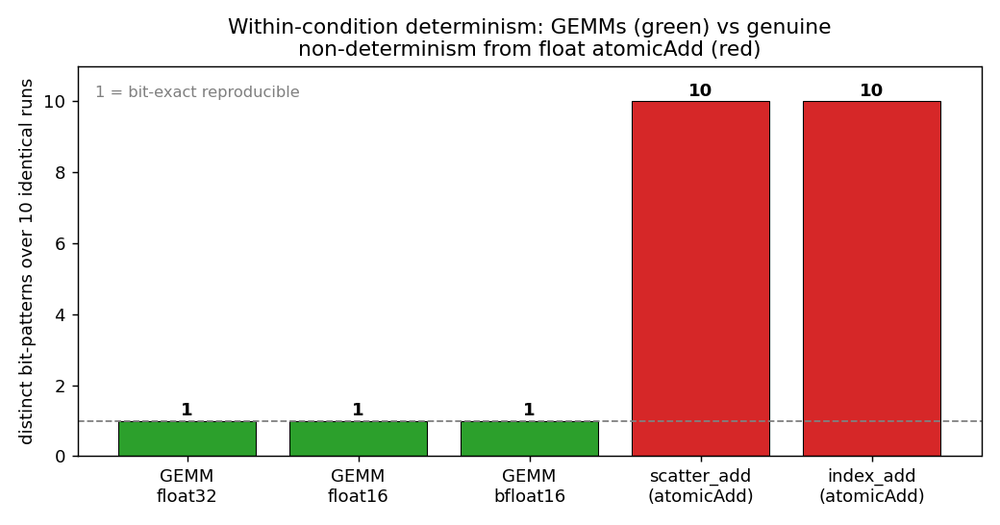
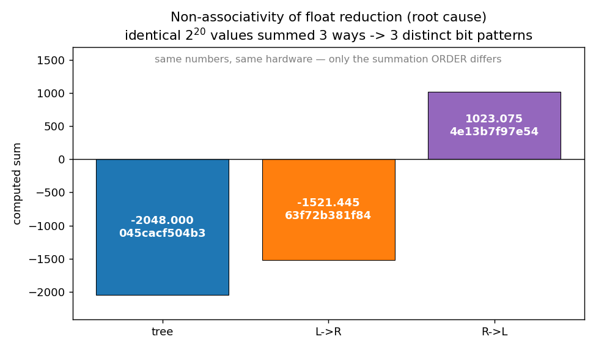
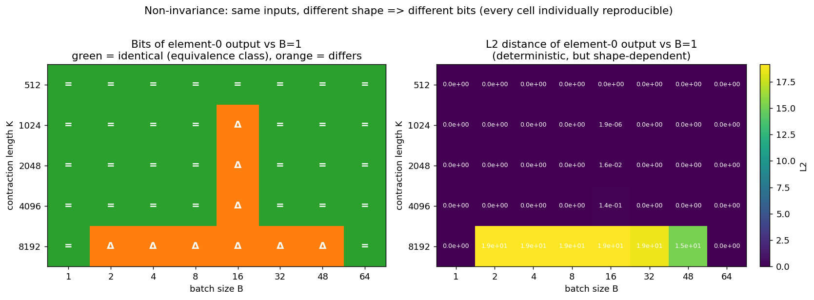
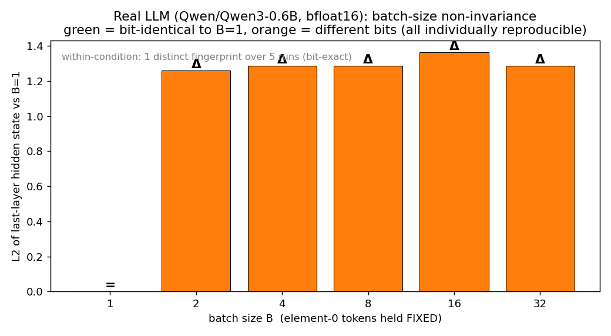

# Bit-Exact Inference Verification — A100 Proof-of-Concept

A small pilot reproducing the **Pillar-A** (empirical determinism) claims of
*"Bit-Exact AI Inference Verification Without Performance Tradeoffs"*
(arXiv 2606.00279v1) on a single **NVIDIA A100-SXM4-40GB**.

The paper's central distinction is between two sources of "noise" in GPU inference:

1. **Genuine non-determinism** — floating-point `atomicAdd`, where the warp arrival
   order is decided at runtime. *Truly* irreproducible, but rare and localized.
2. **Non-invariance** — results are fully deterministic and reproducible, but
   *change with conditions* (batch size, tensor shape, kernel) because float
   addition is **non-associative**: `a+(b+c) ≠ (a+b)+c`. The reduction order, set
   by the GEMM tiling, changes the rounding.

This PoC demonstrates both, with **no determinism flags set** (so no performance
tradeoff), and shows how a single deep-tensor hash becomes a pass/fail verifier
checksum.

## Environment

| | |
|---|---|
| GPU | NVIDIA A100-SXM4-40GB (sm_80) |
| PyTorch / CUDA / cuDNN | 2.7.0 / 12.8 / 9.8 |
| TF32 matmul | off (default) |
| Determinism flags | **none set** |
| Model (E5) | Qwen/Qwen3-0.6B, bf16, eager attention |

Tensors are fingerprinted with **SHA-256 of their raw bytes**: bit-identical ⟺ identical hash.

## Results

### 1. Within-condition determinism vs genuine non-determinism
Repeating the *exact same* op 10× with identical inputs and shape.



- **GEMMs (fp32/fp16/bf16): 1 distinct output over 10 runs — bit-identical.**
- **`scatter_add` / `index_add` (float `atomicAdd`): 10 distinct outputs over 10 runs — genuinely non-deterministic.**

This isolates the paper's type-(1) randomness to exactly the atomic-accumulation kernels;
everything else is bit-stable.

### 2. Non-associativity (the root cause)
The *same* 2²⁰ float values, summed three ways on the *same* GPU.



Tree reduction, left→right, and right→left give **three different bit patterns**
(−2048.0 / −1521.4 / +1023.1). Identical math, identical hardware — only the
summation **order** differs. This is *why* changing a GEMM's tiling changes its output bits.

### 3. Non-invariance to shape (batch × contraction length)
Element-0's input is held **fixed**; we vary batch size `B` and contraction length `K`,
then compare element-0's output bits to the `B=1` reference.



- Every cell is **individually reproducible** (run twice → identical; no `x` markers).
- Bits are **invariant for most shapes** (green, `=`) but **change** for specific ones
  (orange, `Δ`) — notably the `B=16` column and the long-contraction `K=8192` row,
  where cuBLAS selects a different kernel / Split-K reduction order.
- Green regions are the paper's **"equivalence classes"**: distinct batch sizes that
  happen to dispatch the same kernel produce identical bits.

### 4. Same story on a real transformer
Qwen3-0.6B forward pass, element-0 tokens fixed, full attention mask (element 0 cannot
attend to its batch neighbors, so any change is pure GEMM-shape non-invariance compounded
through all layers).



- **Within-condition: bit-identical over 5 runs.**
- The deep hidden-state fingerprint **changes with batch size** (and forms equivalence
  classes — `B∈{4,8,32}` share a hash), yet **every shape is reproducible**.
- L2 ≈ 1.3 because per-layer rounding differences compound over 28 layers — small per op,
  but a *more discriminating* fingerprint deeper in the network.

## Implication for verification

If inference avoids float atomics, a prover need only log a handful of metadata
(SKU, exact weights+quantization, parallel topology, software versions, **and the
per-step batch size**) for outputs to be **bit-for-bit reproducible**. Verification
then collapses to comparing **one cryptographic hash** of a deep tensor
(e.g. last-layer/last-token hidden state — the `verifier_checksum` in
`results/llm_results.json`). Figures 3 & 4 show why the batch size must be logged: it is
the one easily-overlooked degree of freedom that changes the bits.

## Reproduce

```bash
pip install torch transformers safetensors accelerate matplotlib
python experiments.py        # kernel-level E1–E4  -> results/results.json
python llm_experiment.py     # real LLM E5         -> results/llm_results.json
python plots.py              # render all figures  -> results/*.png
```

## Scope / limitations

- This pilot demonstrates **cross-condition reproducibility on the GPU** (Pillar A).
  It does **not** implement Pillar B (the CPU bit-exact emulator that re-derives GPU
  output without the GPU) — a much larger systems effort.
- NVIDIA / sm_80 only; inference only (training's backward pass uses `atomicAdd`
  heavily and is genuinely non-deterministic).
- Dense GEMM / attention only; MoE not tested.
