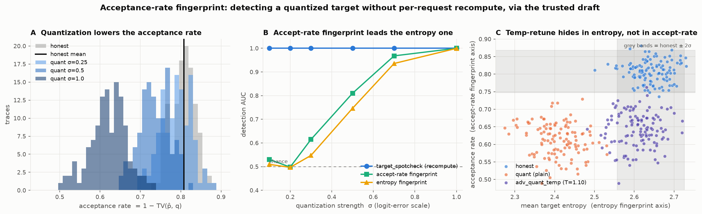
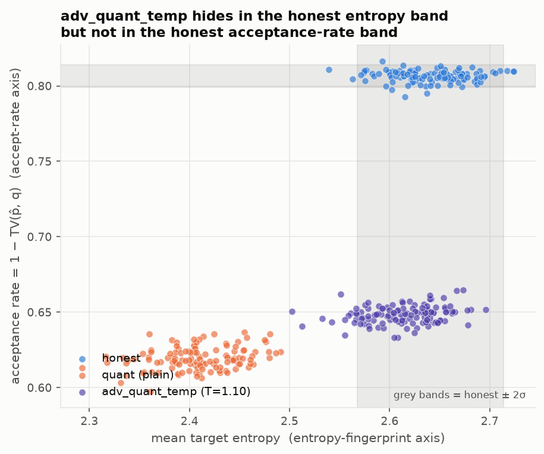

# The acceptance-rate fingerprint: detecting a quantized target without recomputing it

*How speculative decoding's acceptance rate becomes a draft-anchored detector for
target quantization — theory, implementation, and figures.
`ivgym/spec_decode.py`, `experiments/plot_accept_rate_fingerprint.py`.*

## How it works (the theory)

Speculative decoding accepts a drafted token `x ~ q` with probability
`min(1, p(x)/q(x))`. Averaging over `x ~ q`, the expected per-token acceptance
probability is

```
E_{x~q}[ min(1, p(x)/q(x)) ]  =  Σ_x min(p(x), q(x))  =  1 − TV(p, q)
```

So the acceptance rate a provider realizes is a **direct measurement of
`1 − TV(target, draft)`** — the distributional agreement between the target `p`
and the draft `q`. This is the exact quantity the repo already measures in
`exp_family_correlation`.

### What TV means, and why these three quantities are equal

`TV(p, q)` is the **total variation distance** between the target distribution `p`
and the draft distribution `q` — a standard measure of how far apart two
distributions are:

```
TV(p, q) = ½ Σ_x |p(x) − q(x)|  =  max_A |p(A) − q(A)|
```

Two equivalent readings: **half the L1 distance** between the distributions (first
form), or the **largest probability gap** the two distributions can assign to any
event `A` (second form). It ranges from `0` (identical distributions) to `1`
(disjoint supports — they never put mass on the same token).

The chain of equalities above:

* **Right equality — `Σ_x min(p, q) = 1 − TV(p, q)`.** `Σ_x min(p(x), q(x))` is
  the *overlapping mass*, the area shared under both distributions. Using
  `min(a, b) = (a + b − |a − b|)/2`:

  ```
  Σ_x min(p, q) = ½ ( Σ_x p + Σ_x q − Σ_x |p − q| ) = ½ ( 1 + 1 − 2·TV(p, q) ) = 1 − TV(p, q)
  ```

* **Left equality — `E_{x~q}[min(1, p/q)] = Σ_x min(p, q)`.** Expand the
  expectation over `x ~ q` and note `q(x)·min(1, p(x)/q(x)) = min(q(x), p(x))`:

  ```
  E_{x~q}[ min(1, p(x)/q(x)) ] = Σ_x q(x)·min(1, p(x)/q(x)) = Σ_x min(p(x), q(x))
  ```

Intuition: the acceptance rate *is* the overlap between target and draft.

* `TV = 0` → distributions identical → overlap `1` → accept everything (rate 1).
  The draft agrees perfectly with the target.
* `TV = 1` → no overlap → accept rate `0`. The draft is useless.

So `accept_rate = 1 − TV(p, q)` is a **thermometer for how close the draft is to
the target**.

### The trust argument

That thermometer is what makes quantization detectable. The draft model `q` is
small and cheap — the client can hold its own copy — so **`q` is a trusted
anchor**, unlike the expensive target. When a provider quantizes the target
(`p* → p̂`), the realized acceptance rate becomes `1 − TV(p̂, q)` instead of the
honest `1 − TV(p*, q)`. Since `p̂ ≠ p*`, the acceptance rate **shifts** — and the
client can see that shift *without ever recomputing the target*, by comparing the
realized rate to a one-time offline honest reference for this `(target, draft)`
pair.

## How it's implemented

Three pieces in `ivgym/spec_decode.py`, all **client-side** and pure numpy — the
client runs its own proxy `q` and never trusts a provider self-report:

* **`accept_rate(p, q)`** — `Σ min(p, q) = 1 − TV(p, q)`, computed from the served
  target `p` and the client's own proxy `q`. No recompute of `M`.
* **`sequence_features(sample)`** — aggregates `accept_rate` over a served sequence
  (plus `mean_entropy` and `mean_surprisal` for the generic baseline fingerprint).
* **`ProxyReference`** — `.fit(honest_samples)` records the per-feature mean/std of
  a trusted honest run (the external anchor, computed once, offline). `.score(sample)`
  returns the standardized distance `|value − mean| / std` per feature;
  `ProxySpecVerifier` thresholds that z-distance at a target false-positive rate.

The whole method is

```
accept_rate_z = |realized_accept − honest_accept| / honest_accept_std
```

That's it — the power comes entirely from `q` being trustworthy (the client runs it).

## The figures show it works



*Generated by `experiments/plot_accept_rate_fingerprint.py`.*

* **Panel A — mechanism.** As quantization σ grows, the per-sample acceptance-rate
  distribution shifts left (from honest ≈ 0.808 toward ≈ 0.62), because
  `TV(p̂, q)` grows. The fingerprint is just a threshold on this shift.
* **Panel B — it scales, and leads.** Detection AUC vs σ: the acceptance-rate
  fingerprint (green) beats the generic entropy fingerprint (yellow) at every σ,
  while the full recompute baseline (blue) is flat at 1.0. Note both fingerprints
  sit at chance for small σ (≤ 0.2) — realistic quant still needs recompute.
* **Panel C — why it survives the evasion.** In `(entropy, acceptance-rate)`
  space: `adv_quant_temp` tunes temperature to slide back into the honest entropy
  band (grey vertical band) — so an entropy/cross-entropy detector goes blind
  (AUC 1.00 → 0.59) — but it *cannot* re-enter the honest acceptance-rate band
  (grey horizontal band), because retuning temperature doesn't restore
  `TV(p̂, q)`. The draft-anchored axis still cleanly separates it (AUC 0.998).

Panel C is also available standalone:



## Honest caveats

It's the **best of the no-recompute options, not a silver bullet**:

* it needs a one-time trusted reference;
* it only fires once the cheat moves `TV` past honest run-to-run variance — **small
  quant is invisible**, and on real models even `quant_4bit`-strength noise stays
  under that variance (measured in `experiments/exp_spec_verifier_cost.py`: the
  accept-rate AUC sits near chance while `token_difr` separates every attack); and
* it does not dominate `recompute_divergence` (exact full-`M` recompute, AUC 1.0
  throughout).

The deviation it *does* catch on real models is the one that moves `TV(p, q)`
wholesale: **model substitution** (serving a cheaper model and billing for `M`) —
AUC 0.998 without ever running `M`, at a fraction of the recompute cost
(`experiments/exp_spec_substitution_gpu.py`).

What it buys is a **shrink in how often the exact recompute must fire** — the
draft-anchored acceptance-rate test is the one no-recompute algorithm the
client-side proxy adds *over* generic black-box statistics, because matching
entropy does not restore `TV(p̂, q)`.

## Run it

```bash
python -m experiments.plot_accept_rate_fingerprint   # regenerates both figures
python -m experiments.exp_proxy_spec_verify          # CPU sweep (+ real proxy if IVGYM_M/IVGYM_PROXY)
python tests/test_proxy_spec.py                      # dependency-free tests
# real-model GPU runs:
python -m experiments.exp_spec_substitution_gpu      # the win case: model substitution
python -m experiments.exp_spec_verifier_cost         # cost saving vs detection AUC
```
