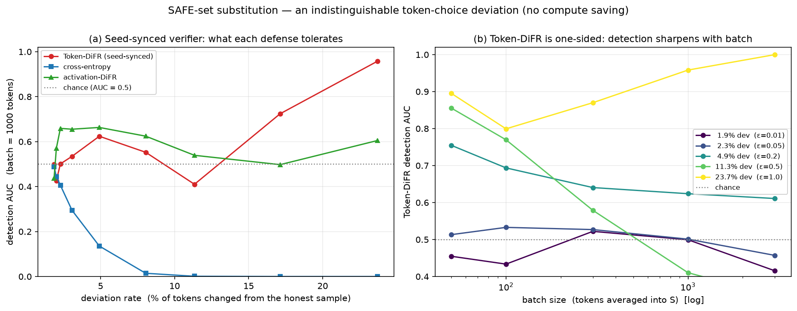
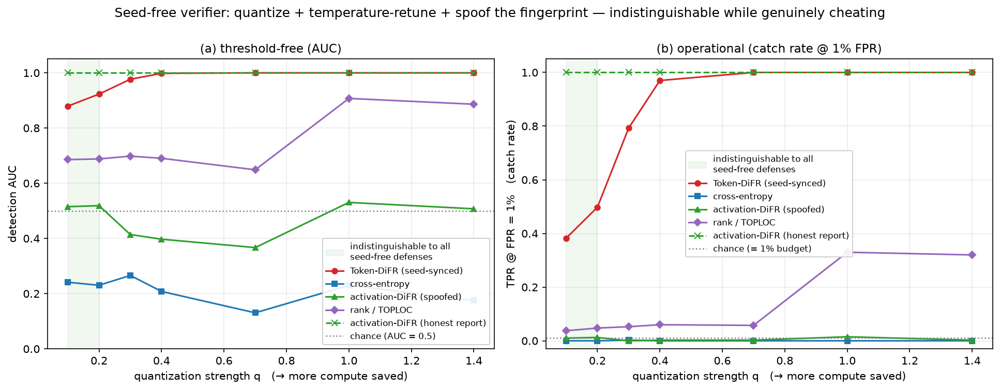

# Indistinguishable attacks: two regimes

The verification game (see [GAME.md](GAME.md)) is won by the **attacker** when it
deviates from the sampling spec ϕ yet keeps the batch statistic `S` below the
verifier's threshold τ — i.e. detection **AUC ≈ 0.5** and **TPR@1% ≈ 0.01** (the
false-positive budget). This note documents two attacks that reach that bar, and
the structural reason each is the *best possible* against its verifier.

The two attacks are separated by one capability: **can the verifier replay the
provider's sampling RNG?**

| | **Seed-synced verifier** | **Seed-free verifier** |
|---|---|---|
| Available defenses | Token-DiFR + everything below | cross-entropy, activation-DiFR, rank/TOPLOC |
| Strongest defense | Token-DiFR (post-Gumbel margin) | rank check (`topk_overlap`) |
| Indistinguishable attack | SAFE-set token substitution | quant + temp-retune + fingerprint spoof |
| What it can hide | a **covert channel** (~2% of tokens) | **real compute saving** (quant `q ≤ 0.2`) |
| What it *cannot* hide | compute cheating (one-sidedness) | aggressive quant (rank is one-sided) |

**Throughline:** a *one-sided* per-token score (rank or post-Gumbel margin, both
`≥ 0` and `= 0` only at the honest token) fundamentally caps forward-pass
cheating in both regimes. Seed synchronization additionally catches
sampling-process deviations (seed/temperature) that don't change rank, and
tightens detection to AUC 1.0.

---

## 1. Seed-synced regime — SAFE-set substitution

*Attack:* [`examples/safe_set_strategies.py`](../examples/safe_set_strategies.py) ·
*Experiment:* [`experiments/exp_safe_set.py`](../experiments/exp_safe_set.py)

### The opening
Token-DiFR scores `s_t = z[v*] − z[claimed] ≥ 0`, where `z = filt + temp·gumbel`
and `v*` is the verifier's Gumbel-Max winner. It is **0 only when the provider
claims `v*`**. Crucially the sampling seed in ϕ is *public*, so the provider can
reconstruct the exact `z` the verifier will score against, and deviate **only
among near-ties**: when the runner-up is within ε of the winner in both raw-logit
space (keeps cross-entropy unmoved) and post-Gumbel `z`-space (keeps Token-DiFR
unmoved), and is rank-#2 by logit (deep inside the filter, so the verifier can't
filter it out and emit the Δ=30 penalty), claim it instead. The forward pass is
left honest, so cross-entropy and activation-DiFR see nothing.

This is exactly the stego **SAFE set** of [GAME.md §5](GAME.md): the provider
emits tokens that differ from the honest sample (a covert / exfil channel) while
staying inside `S ≤ τ`.

### Result
At ε = 0.01 the attack deviates on **1.9% of tokens** yet is indistinguishable to
*every* defense — AUC ≈ 0.5, TPR@1% = 0.01 (= the FPR budget) at all batch sizes:

| ε | deviation rate | token_difr (TPR@1%) | cross_entropy | activation_difr |
|---|---|---|---|---|
| **0.01** | **1.9 %** | **0.47 (0.01)** | 0.38 (0.00) | 0.53 (0.01) |
| 0.05 | 2.3 % | 0.50 (0.01) | 0.28 (0.00) | 0.59 (0.02) |
| 0.2  | 4.9 % | 0.62 (0.04) | 0.07 (0.00) | 0.56 (0.02) |
| 1.0  | 24 %  | 0.96 (0.45) | 0.00 (0.00) | 1.00 (1.00) |

(batch = 1000; AUC (TPR@1%). `activation_difr` drift above 0.5 is a backend
artifact — two *honest* providers show the same drift, since each config gets its
own benign-noise RNG stream. The attack never touches the forward pass.)

### Why this is the best possible against Token-DiFR
Because the score is **one-sided**, any systematic deviation only ever *adds*
positive mean, which batch-averaging surfaces. So indistinguishability has a
**bounded capacity** that shrinks as the batch grows: push ε up to deviate on
more tokens and detection climbs to AUC 1.0, faster at larger batch
(Figure 1b). There is no forward-pass-cheating attack that hides here — which is
the gym's headline (Token-DiFR catches quant/fp8/seed at AUC 1.0).



*Figure 1 — (a) detection AUC vs how many tokens the attack changes: Token-DiFR
is the binding constraint; cross-entropy and activation-DiFR stay at/below
chance. (b) Token-DiFR AUC vs batch size for several deviation rates: small
deviations hug chance, larger ones are surfaced by averaging — the one-sidedness
signature.*

---

## 2. Seed-free regime — quant + temp-retune + fingerprint spoof

*Attack:* [`examples/seed_free_strategies.py`](../examples/seed_free_strategies.py) ·
*Experiment:* [`experiments/exp_seed_free.py`](../experiments/exp_seed_free.py)

When the verifier cannot replay the provider's sampling RNG, **Token-DiFR is
unavailable** and every remaining signal is a function only of what the provider
*emits* (the claimed token, or the reported activation fingerprint). The attack
composes three moves:

1. **Quantize the forward pass** (logit perturbation) — the genuine compute saving.
2. **Retune temperature** so mean cross-entropy matches honest — collapses the CE detector.
3. **Spoof the activation fingerprint** — report a clean reference activation,
   decoupled from the cheap computation. Activation-DiFR is only as strong as the
   *binding* between the reported fingerprint and the served output; a seed-free
   verifier provides no such binding.

### Result

| quant q | tunedT | token_difr\* | cross_entropy | activation_difr | topk_overlap | act(honest) |
|---|---|---|---|---|---|---|
| 0.1 | 1.00 | 0.88 (0.38) | 0.24 (0.00) | 0.52 (0.01) | 0.69 (0.04) | 1.00 (1.00) |
| **0.2** | 1.00 | 0.92 (0.50) | **0.23 (0.00)** | **0.52 (0.01)** | **0.69 (0.05)** | 1.00 (1.00) |
| 0.4 | 1.00 | 1.00 (0.97) | 0.21 (0.00) | 0.40 (0.00) | 0.69 (0.06) | 1.00 (1.00) |
| 1.0 | 0.98 | 1.00 (1.00) | 0.23 (0.00) | 0.53 (0.01) | 0.91 (0.33) | 1.00 (1.00) |
| 1.4 | 0.95 | 1.00 (1.00) | 0.18 (0.00) | 0.51 (0.00) | 0.89 (0.32) | 1.00 (1.00) |

(batch = 1000; AUC (TPR@1%). \* Token-DiFR needs seed-sync, unavailable here;
shown to contrast. `act(honest)` = activation-DiFR if the provider reports its
**real** quantized activation instead of spoofing.)

Three findings:

1. **Against `{cross_entropy, activation_difr}` the attack is indistinguishable at
   every quant strength** while genuinely quantizing up to `q = 1.4` — yet the
   *same* attack is caught instantly (AUC 1.0) once seed-sync is available.
2. **Spoofing is load-bearing:** the `act(honest)` column is 1.00 (1.00)
   everywhere. Activation-DiFR is robust *iff* the fingerprint is bound to the
   computation.
3. **A rank detector (`topk_overlap`, TOPLOC-style) is the catch.** Being
   one-sided like Token-DiFR, it resists forward-pass cheating even without
   seed-sync, setting a **frontier**: only `q ≤ 0.2` stays hidden from all
   seed-free defenses; beyond that, rank fires.



*Figure 2 — detection vs quantization strength (left: AUC, right: catch rate at
1% FPR). Cross-entropy and spoofed activation-DiFR stay at chance; honestly
reported activation-DiFR and the seed-synced Token-DiFR sit at 1.0; the rank
detector rises with q. The shaded band is the indistinguishable compute-cheating
frontier.*

---

## Reproduce

```bash
python -m experiments.exp_safe_set     # seed-synced: SAFE-set substitution table
python -m experiments.exp_seed_free    # seed-free:   compute-cheating frontier table
python -m experiments.figures          # render docs/figures/*.png

# or via the no-edit runner:
python -m experiments.run --strategies examples/safe_set_strategies.py \
    --defenses token_difr cross_entropy activation_difr \
    --attacks safe_set_eps0.01 safe_set_eps0.2 safe_set_eps1.0
```

## Assumptions & scope

- **Synthetic backend.** Quantization is modelled as logit/activation noise (see
  `ivgym/attacks.py`); absolute AUCs are illustrative, the *structure* is the
  result. The attacks run unchanged on `--backend hf_gpu`.
- **Fingerprint spoofing** assumes the provider can report an activation
  decoupled from its served (cheap) computation — precisely the binding a
  seed-free verifier lacks. The `act(honest)` column shows the alternative
  (honest reporting → caught).
- The SAFE-set attack uses one minimal, backward-compatible hook,
  `Attack.resample(filt, gumbel, spec, honest_token, rng)` (default no-op), wired
  into the synthetic backend; existing attacks and all smoke tests are unaffected.
