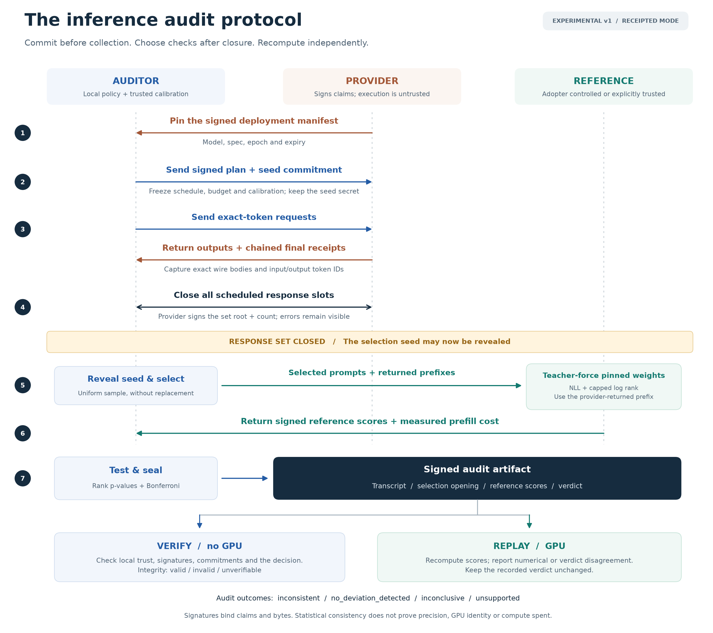

# IVGym audit protocol, draft v0.1

**Scope:** this document describes the optional signed-artifact experiment.
The primary product is the [independent token and clock verification service](VERIFICATION_SERVICE.md);
it does not require provider receipts.

Status as of 2026-09-13: experimental artifact and Hugging Face HTTP MVP
implemented and tested on an H100. The broader design below remains an RFC;
it is not a validated security or deployment error-rate claim. See the
[executable implementation contract](AUDIT_IMPLEMENTATION.md) and
[measured pilot](results/audit_protocol_h100.md).

The original proposal was prepared against the repository and the supplied
Gupta–Katz–Miers PDF on 2026-09-13. The subsequent pilot ran 106 complete blocks
through collection, closure, selection, independent scoring and artifact
verification, plus one separate-process CLI audit. At a 5% per-audit threshold
with 63 calibration blocks, it flagged 1/20 honest blocks, 10/10 temperature
overrides and 0/10 actual NF4 blocks. All 107 transcripts verified; the four
selected replay checks reproduced scores exactly. The full suite passed 112
tests. These observations demonstrate a working protocol and sampler-deviation
signal, not validated quantization detection or a rare false-positive bound.

The implemented release produces reproducible statistical evidence about a
bounded collection of responses from a named endpoint. Cryptographic signatures
bind parties to the evidence; they do not establish which computation ran.

After provisioning keys, trust, a reference and calibration as described in the
implementation guide, the executable interface is:

```sh
ivgym audit http://127.0.0.1:8765 --model Qwen/Qwen3-0.6B \
  --spec spec.json --calibration calibration.json --prompts prompts.json \
  --reference reference.json --trust trust.json \
  --auditor-key auditor.pem --reference-key reference.pem --out transcript
# transcript/verdict.json + evidence files + manifest.json + transcript.sig
ivgym verify transcript --trust trust.json
ivgym replay transcript --trust trust.json --reference reference.json
```

The endpoint must implement the negotiated `/ivgym/` exact-token extension.
This is not yet a one-command audit of an arbitrary OpenAI-compatible endpoint;
a missing required receipt capability returns `unsupported`. `verify` checks
signatures, commitments and the decision calculation from recorded scores.
`replay` independently recomputes model scores and reports numerical agreement
under the recorded calibration profile. They have different compute requirements
and trust assumptions.

The implementation is limited to raw token IDs, explicit full-softmax sampling,
one fixed-horizon audit, and a pinned BF16 reference profile. Requirements below
for vLLM, streaming, wider sampler contracts, deployment calibration, persistent
campaign accounting, external witnesses and exact-relation proofs are follow-on
work unless the implementation guide explicitly marks them supported.



*Figure: the implemented receipted-mode workflow. The provider closes the response
set before the auditor reveals selection randomness. Signatures bind evidence;
the trusted reference supplies the independent model scores.*
[SVG](figures/fig_audit_protocol.svg) · [PDF](figures/fig_audit_protocol.pdf).

## 1. What to take from the paper

The supplied *Private and Verifiable Outsourcing of Open-Weight LLM Inference*
provides three useful design ideas in Sections 4.2–4.4: reusable verification
material bound to a model, an explicit split between outsourced computation and
trusted local computation, and randomized batching of already received results.
Its linear check has the form

\[
R_i=g^{r_i},\quad S_j=g^{(M^T r)_j},\qquad
\prod_i R_i^{y_i}=\prod_j S_j^{x_j}.
\]

This checks a matrix-vector relation with published group elements under the
paper's setup and discrete-log assumptions. It is not an output-only test of a
chat completion. The client possesses intermediate vectors, performs nonlinear
operations locally, and runs a modified fixed-point inference computation.

Several distinctions must survive any adaptation:

* Section 3 assumes an honest model owner. Privacy requires two non-colluding
  servers; the paper states that integrity does not require non-collusion.
* The setup knows the exponents `r`. Whoever knows them can construct relations
  that defeat verification. A provider cannot simply generate its own setup and
  declare itself verified. Authentication of setup bytes and trustworthy setup
  generation are separate requirements.
* Section 4 converts floating-point linear layers to fixed-point arithmetic.
  This proves a relation for that encoded computation, not native BF16 vLLM.
  Signed integer lifts, ring-to-field conversion, overflow bounds, rescaling,
  rounding and permitted inputs need explicit executable semantics. In
  particular, `p > N` alone does not establish every required range bound.
* Section 5 uses custom integer CUDA kernels. Table 2 reports 5.21 seconds and
  135.62 MB per token for Llama-2-70B, with 322 round trips; its verification
  column is amortized differently, covering 100 tokens. The speedup over private
  inference baselines is not evidence of low overhead over ordinary vLLM.
* A batching coefficient must be unpredictable while the corresponding response
  can still change. Delayed checking also means streamed outputs are provisional
  until verification succeeds.

These are reasons to specify and benchmark an adaptation carefully, rather than
to inherit either its headline performance or an accusation that its underlying
primitive is broken. A cryptographic implementation needs a separate review.

## 2. Supported claims and trust boundaries

| Mode | Required integration | What the artifact establishes |
|---|---|---|
| `observed` | Ordinary compatible endpoint; auditor captures traffic | The auditor signed these observations and this statistical analysis |
| `receipted` | Provider signs model/spec manifests and exact request/response receipts | The provider endorsed these response bytes under this claimed spec; the analysis can be checked |
| Future `relation_verified` | Custom execution protocol with intermediate relations and trusted local operations | Correctness of the specified encoded computation, subject to the proof system's assumptions |

An ordinary HTTPS exchange does not supply a portable provider signature over
the response. A required receipted mode must return `unsupported` when receipts
are unavailable; it must never silently substitute an auditor signature.

Actors:

* **Adopter/auditor:** supplies prompts or a traffic capture, sets the audit policy,
  selects checks, and signs observations and the final decision.
* **Provider:** controls the endpoint, its serving software and hardware. Its
  metadata, logits, timing claims and activations are untrusted assertions.
* **Reference executor:** runs the pinned open weights on adopter-controlled
  hardware, or on an explicitly trusted independent service. A second unsigned
  API call to the provider being audited is not a reference.
* **Calibration publisher:** supplies authenticated honest-run data, the frozen
  scoring procedure, applicability limits and validation results. Its provenance
  must be independently trusted; the target provider cannot define its own null.
* **Reviewer:** checks artifact integrity without a GPU, or reruns the reference
  computation for independent evidence. Trust roots come from local policy,
  not exclusively from keys embedded in the artifact.

The null is behavioral consistency within a specified family of honest serving
conditions. A non-rejection does not prove BF16 execution, GPU identity, no
speculation, a compute bill, or compliance on traffic outside the captured set.
Even a proof of the mathematical output does not prove how much compute was
spent producing it. Distribution-preserving optimizations are observationally
indistinguishable through tokens alone.

## 3. The specification is an executable contract

`SamplingSpec` currently contains temperature, top-k, top-p and seed. Retain it
as a detector input; introduce a separate, versioned `AuditSpec` containing:

| Component | Required bindings |
|---|---|
| Model | Repository identifier, immutable revision, weight/config/tokenizer/chat-template digests, adapters or explicit absence |
| Generation | All effective sampler parameters; processor ordering; stop/EOS semantics; context/truncation policy; reasoning mode; output cap |
| Arithmetic | Claimed weight/activation/KV formats and the permitted numerical execution family |
| Input/output | Exact token IDs and original wire bytes; any hidden prompt or omitted reasoning state makes token replay unsupported |
| Reference | Trusted executor identity, model manifest, software image digest and replay configuration |
| Calibration | Bundle digest, publisher identity, supported domains/lengths/hardware pairs, frozen detector and selection policy |
| Statistics | Audit unit, fixed sample size, detector combination, error budget, scope of repeated testing, validity prerequisites |
| Resources | Request, generation, prefill and monetary limits; behavior on exhaustion |
| Evidence | Required receipt mode, pinned signer identities, serialization and artifact versions |

Distinguish asserted properties from properties actually tested. For example,
BF16 can be the provider's commitment while the verdict only tests compatibility
with a calibrated BF16 reference. Do not output `precision_verified: true`.

The model alias `qwen3-8b` is display text. It cannot replace immutable digests.
Generation defaults must be explicit: inherited model generation configuration,
templates and Qwen reasoning behavior are potential benign mismatches.

The companion [spec template](../examples/audit-spec.template.json) deliberately
contains unresolved values. Resolving them is provisioning, not something an
audit should guess. The one-command experience assumes installed trust roots,
an applicable calibration bundle and a provisioned reference executor.

## 4. Message sequence for receipted auditing

Use vetted implementations of SHA-256, Ed25519 and canonical JSON (RFC 8785).
Reject duplicate keys, invalid numbers, unsupported versions and malformed
encodings before hashing. Sign a domain-separated typed envelope, with explicit
length framing, protocol version and signer role. The fields below are logical
message contents, not a substitute for a wire schema and conformance vectors.

1. **Freeze the contract.** The provider signs a deployment manifest binding its
   public-key identity, endpoint origin, model/spec digests, deployment epoch,
   expiry and receipt capabilities. The auditor pins this manifest and signs an
   audit plan containing the calibration digest, detector policy, finite request
   schedule, budget and a fresh session nonce. A provider may update deployments
   only by creating a new epoch; responses from different epochs are not pooled.

2. **Commit to future audit selection.** Before collecting the audit block, the
   auditor samples a secret 256-bit seed `s` and records
   `H("ivgym-selection-v1", session, s)` in the signed plan. The provider receives
   the commitment but not `s`. The fixed schedule includes a termination rule so
   neither party gets to wait for a favorable subset of responses. A witnessed
   plan or external log is needed if a reviewer must rule out the auditor
   discarding entire unfavorable sessions; a local signature alone cannot do so.

3. **Serve and bind each response.** Every request has a session ID, request nonce
   and digest of exact inputs and generation settings. The provider's final
   receipt signs these, the deployment manifest digest, effective-spec digest,
   complete ordered output token IDs/byte digest, finish reason, sequence number
   and prior-receipt hash. Any evidence blob has a type, length and digest in
   this receipt. Streaming chunks can be hash-chained and covered by the final
   signature. No final receipt means no complete receipted response.

4. **Close the response set.** Build an ordered manifest of all scheduled request
   slots and their outcomes, including errors, retries and incomplete streams.
   Each retry gets a fresh request identity and remains visible. The provider
   signs the set's root and count in receipted mode. The auditor records local
   receipt times separately. Missing required entries produce `inconclusive`
   with a protocol-completeness reason, rather than statistical evidence of
   model cheating. Availability can have its own separately defined contract.

5. **Reveal and derive checks.** Only after closure does the auditor reveal `s`.
   Derive selection randomness with a specified cryptographic KDF from `s`, the
   closed root and session ID. Select a fixed number of complete responses
   uniformly without replacement using a versioned unbiased sampler. Select
   fixed prefix depths, or use a separately calibrated policy. Everyone can
   verify the seed commitment and reproduce the selection. Generation seeds
   and audit-selection seeds are separate objects.

6. **Recompute independently.** The reference executor teacher-forces the exact
   prompt and *provider-returned prefix* under the pinned reference, preserving
   stop/context/sampler semantics. It computes reference NLL/rank scores on the
   selected positions. The executor signs input/selection/model/image digests,
   output-score digests, hardware profile and measured prefill cost. A receipt
   signing service or daemon does not thereby attest that its GPU ran those
   weights; local control or explicit trust in that executor remains necessary.

7. **Decide and seal.** Apply the frozen decision rule and write `verdict.json`.
   An auditor-signed top-level artifact manifest covers the verdict, all message
   records, selection opening, calibration bundle, reference result, timing
   observations and errors. Define the signature envelope outside the manifest
   it signs to avoid self-reference. A replay must identify any disagreement
   rather than automatically editing the recorded verdict.

A minimal provider integration is a receipt middleware around vLLM. It binds
what the provider claims and returned. It does not certify the engine's internals.
Future activation checks must bind the original evidence before challenge
disclosure; accepting freshly recomputed activations afterward permits repair.
Even committed fingerprints are only statistical evidence unless all relevant
relations are soundly linked to inputs, outputs and the model.

In `observed` mode the auditor performs the same collection, closure and selection
locally and signs its capture. Provider endorsement is explicitly absent.

## 5. False-positive control that applies to deployment

The current `harness.evaluate` permutes flattened honest token scores into
calibration and evaluation splits. The pool-ratio ceiling addresses one reuse
artifact; it does not establish independence between responses, validity under
hardware shift, or control of repeated deployment decisions.

For v0.1, use a fixed-horizon test. Define **one audit block** as the entire
collection, selection, recomputation and aggregation workflow above. Freeze
feature transforms, winsorization and detector choice on a development split.
Calibrate on separately generated honest blocks; evaluate on a third split.
Keep source documents, conversations, response runs and serving sessions together.
Use fresh runs rather than treating shuffled or bootstrapped tokens as fresh
deployment trials. Block bootstrap can inform uncertainty analysis, but cannot
manufacture rare false-positive observations.

One implementable baseline is a conservative rank test. For detector `d`, let
`S_d` be the fixed block score and `S_h,d,i` the `m_h` honest calibration scores
for a supported nuisance condition `h`:

\[
p_{h,d}={1+\#\{i:S_{h,d,i}\ge S_d\}\over m_h+1},\qquad
p_d=\max_{h\in\mathcal H}p_{h,d}.
\]

Reject if any `p_d <= alpha / D`, for `D` prespecified detectors. The maximum
protects a composite honest null when the actual honest block distribution is
represented by at least one `h` for which exchangeability holds. Bonferroni does
not require independence between detectors. The exchangeability assumption,
finite calibration resolution and allowed nuisance family must be visible in
the verdict. This is marginal rank-test validity, not a distribution-free
conditional guarantee for every deployment using one frozen calibration set.
See [exchangeability and rank tests](https://arxiv.org/abs/2005.06095).

Hardware configurations alone do not define the entire null: traffic mixtures,
load trajectories and domain/length distributions matter. Separate pure-hardware
cells do not automatically cover arbitrary within-block routing mixtures.
Calibrate permitted mixtures explicitly. An unsupported domain or execution
family returns `inconclusive`; applicability cannot be proved from a provider's
self-reported GPU name. Do not silently learn a new null from target traffic.

At `alpha = 1e-4`, a single nonrandomized rank test needs at least 9,999
calibration blocks even to attain that p-value; two Bonferroni tests need 19,999
per relevant condition. That is a substantial data requirement. Reducing alpha
in a configuration file does not produce the required evidence.

Separately certify the frozen operating point on independent honest audit
blocks. With zero flags in `N` independent Bernoulli trials, the one-sided 95%
upper bound on the flag probability is `1 - 0.05**(1/N)`. It takes 29,956 such
trials to put that upper bound below `1e-4`. This assumes representative,
independent blocks; correlated traffic invalidates that binomial calculation.
Simultaneous claims across many profiles require a confidence allocation too.
See [NIST exact binomial intervals](https://itl.nist.gov/div898/software/dataplot/refman2/auxillar/exacbici.htm).

Choose the error rate from an operational horizon. A per-audit rate of `1e-4`
still allows 100 expected flags across one million honest audits. For a bounded
monitoring campaign, preallocate `alpha_j` with `sum(alpha_j) <= alpha_campaign`
and record consumption; restarting the process does not reset the campaign.
Add sequential stopping only with a derivation valid under the actual dependent
null. Ordinary plug-in Gaussian evidence or repeated fixed-horizon p-values do
not become anytime-valid by naming them an e-process.

Report detection power and cost per real attack separately from false-positive
control. A deliberately conservative, powerless test is not deployment success.
An optional claim about a fraction of deviating requests additionally needs a
sampling population and a validated detector sensitivity. The ideal probability
of missing all bad requests in a uniform sample is hypergeometric; replacing
that with perfect detector sensitivity would overstate this protocol's power.

## 6. Verdict and artifact semantics

Use four statistical outcomes:

* `inconsistent`: rejected the registered honest null under its stated assumptions.
* `no_deviation_detected`: completed applicable checks without rejection. Attach
  measured attack-specific power; never translate this into probability of honesty.
* `inconclusive`: insufficient budget, missing evidence, unresolved tokenization,
  unsupported calibration domain, or incomplete scheduled data.
* `unsupported`: the endpoint lacks a required protocol capability.

Artifact integrity is a separate result: `valid`, `invalid`, or `unverifiable`.
A forged signature is an artifact failure, not a calibrated inference rejection.
A signer does not gain identity merely by supplying a public key inside a ZIP.

The verdict records protocol/spec/calibration/model hashes; claim scope and epoch;
provider-endorsement status; reference trust mode; request and audited-prefix
counts; all detector p-values and thresholds; alpha and its horizon; assumptions
and applicability status; measured power references; costs; exclusions/errors;
and the transcript root. Missing measurements remain null, never invented.

The transcript includes raw requests and response bytes, exact IDs, effective
settings, signatures, selection evidence, scoring inputs/results, calibration
scores and software manifests. Minimal verification redoes the decision from
those scores; it cannot establish that the signed reference scores are correct.
Independent replay requires model weights, suitable hardware and the permitted
numerical profile. Boundary-sensitive replays must be reported as disagreements.

Keep private traffic bundles access-controlled and encrypted for storage/sharing.
An output hash does not make short prompts private against guessing. Redaction
reduces replayability and must be declared. The statistical API audit provides
no privacy from the serving provider; the paper's two-server privacy protocol
would be a different backend with different deployment assumptions.

## 7. Real vLLM experiments and cross-hardware calibration

**Current status:** `ProviderClient`, `ReferenceExecutor` and `AuditRunner` are
implemented separately in `ivgym.audit`. The H100 pilot exercised genuine HF
HTTP generation, including NF4, with independent teacher-forced reference
scoring. The following vLLM and cross-hardware matrix remains untested. The MVP
uses versioned unfiltered NLL and capped log-rank scores; it does not adapt the
old harness's seed-synchronized or activation checks into deployment verdicts.

Split the current combined backend contract into `ProviderClient` (remote
generation/capture), `ReferenceExecutor` (trusted teacher-forced scoring) and
`AuditRunner` (selection/statistics/artifacts). Preserve adapters into `VContext`
so detector implementations can be reused without giving the remote provider
control over reference arrays.

Start with seed-free reference NLL and `token_toploc`, validating the *joint*
decision rule. NLL and rank are imperfect anomaly scores, not general proofs of
sampling. The existing `CrossEntropy` uses an unfiltered softmax, so label it as
that feature or implement a separately versioned sampler-aware score; do not
claim it is the exact served likelihood under top-k/top-p.

Disable `token_difr` until a sampler contract specifies the RNG, counter layout,
token indexing, processor order, ties and floating-point behavior with golden
vectors. `sampling.gumbel_noise` uses NumPy's RNG; matching an exponential-noise
distribution does not match vLLM random draws. Disable activation checks when
original committed evidence is absent: the current `ActivationDiFR` returning
zero for missing fingerprints must not turn missing evidence into a pass.

vLLM supports compatible HTTP serving and additional parameters; negotiate and
test exact token-ID support against a pinned version. Do not recover exact
generation token IDs by assuming text re-tokenization is reversible. If hidden
tokens or provider preprocessing prevent reconstruction, either use a separately
calibrated text-only method or return an unsupported replay result.
See the [vLLM server interface](https://docs.vllm.ai/en/latest/serving/online_serving/openai_compatible_server/).

Build a real server matrix with immutable checkpoint and container manifests:

| Honest nuisance controls | Real deviations |
|---|---|
| Same weights on A100/H100/L40S, supported execution profiles | AWQ/GPTQ/INT8 checkpoints derived from the exact base revision |
| Continuous batching, concurrent short/long requests, warm/cold prefix cache | Actual FP8 KV cache when the spec forbids it |
| Kernel, tensor-parallel and serving-version changes allowed by the spec | Smaller-model substitution, partial routing and layer-specific precision changes |
| Correct speculative decoding when permitted | Temperature/top-p overrides and patched sampler behavior |
| Network proxy buffering, chunk coalescing, latency/load variation | Context truncation, stale-cache reuse and intentional response shaping |

Generate on hardware A and replay on B in both directions. Include actual
provider execution changes as well as verifier replay changes. Use held-out
machines, sessions, source documents and deployment days. Hold out an entire
profile to test generalization; if coverage fails, narrow supported profiles.
Record paired benign/attack score shifts, complete audit FPR with intervals,
attack TPR, abstention rate, generation throughput, reference GPU-seconds,
prefill tokens, bytes and wall-clock audit time.

The vLLM documentation limits reproducibility to the same hardware/version even
with reproducibility settings. Its batch-invariance feature is a useful control,
not evidence of cross-hardware equality. See
[reproducibility](https://docs.vllm.ai/en/latest/usage/reproducibility/) and
[batch invariance](https://docs.vllm.ai/en/latest/features/batch_invariance/).

Treat wire timing as diagnostic in v0.1. SSE chunks are not individual GPU token
events. Queueing, networking, legitimate batching/speculation and intentional
padding can change apparent slopes. Measure these effects through a real reverse
proxy before allowing timing to contribute to a rejection rule.

Test a verifier-aware attacker: serve the correct model to identifiable audit
traffic, tune sampling to defeat NLL/rank, quantize selected layers, falsify
metadata, drop receipts and recompute evidence after challenge. Post-response
selection protects selection among captured requests; it cannot hide a dedicated
audit account or prove behavior on other customers. Production coverage needs
capture of real requests through the ordinary path and a declared population.

## 8. Build sequence and acceptance gates

| Gate | Status after the H100 pilot | Remaining scope |
|---|---|---|
| Artifact MVP | Implemented; strict schemas, signatures, offline checker, adversarial tests and fixed wire vectors | Independent implementation/security review and broader conformance coverage |
| Real server MVP | Implemented for the local HF HTTP extension; honest, temperature-override and actual NF4 generation tested | vLLM, ordinary endpoint integration, streaming and production serving |
| Calibration release | Exploratory signed bundle with 3 development, 63 calibration and 40 held-out blocks | Validated FPR and power targets, representative nuisance coverage and rare-error certification |
| Deployment evaluation | Not completed | Cross-hardware pairs, load, routing, independent sessions/days and adaptive attackers |
| Optional exact-relation backend | Not implemented | Encoded arithmetic semantics, setup trust, reviewed proof checks and measured costs |

The original acceptance gates below remain the broader release criteria. The
pilot does not close the calibration or deployment gates; v1 returns
`inconclusive` whenever a validated operating point is required.

1. **Artifact MVP:** add packaging/CLI, versioned spec/message schemas,
   canonicalization, signatures and an offline checker. Test mutation, replay,
   cross-session substitution, wrong trusted keys, omitted/reordered records,
   unsupported versions and missing final receipts. Golden vectors must be
   consumable by an independent implementation.
2. **Real server MVP:** implement HTTP capture and receipt middleware, independent
   reference scoring and one genuine quantized/substituted server. Demonstrate
   the full command on an honest server and a deviating server; publish costs
   and inconclusive outcomes as well as detections.
3. **Calibration release:** publish frozen development/calibration/test partitions,
   complete honest blocks and an authenticated applicability manifest. Release a
   claimed operating point only when its FPR confidence bound and attack power
   meet preregistered targets. Unsupported precision-detection claims stay absent.
4. **Deployment evaluation:** add cross-hardware pairs, serving load, mixed routing,
   network capture and adaptive attackers. A positive benign shift overlapping
   the attack signal calls for narrower claims or abstention; more tokens do not
   repair a misspecified null.
5. **Optional exact-relation backend:** prototype one linear layer using the
   paper's mechanism, then measure setup, verification, bytes and latency. Specify
   integer semantics, authenticate model-bound verification material and review
   setup trust before extending it. Full inference needs linked linear inputs/
   outputs, embeddings, nonlinear operations, attention/KV state and the sampler.
   Spot-checking signed linear outputs alone is not a complete inference proof.

The repository now has a separate collection and decision boundary in
`ivgym.audit`; the research harness remains useful for exploration. Completing
the remaining calibration and deployment gates requires new evidence beyond
the implemented protocol and this single-H100 pilot.
