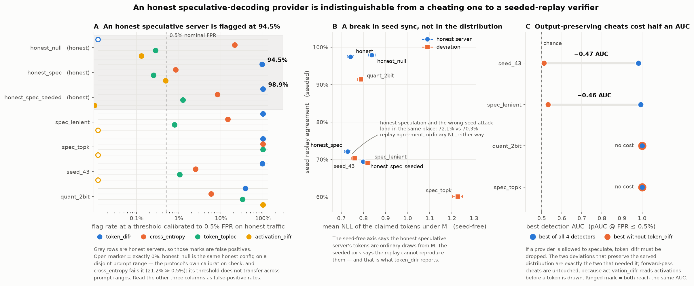
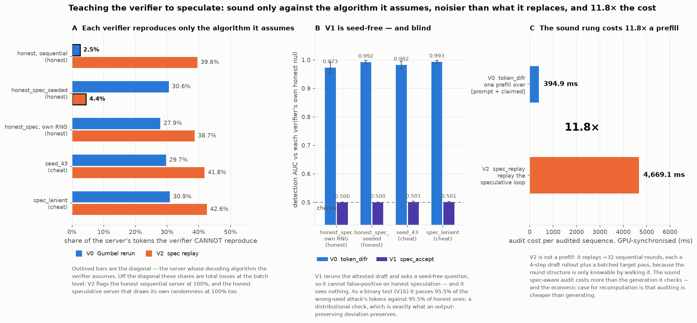
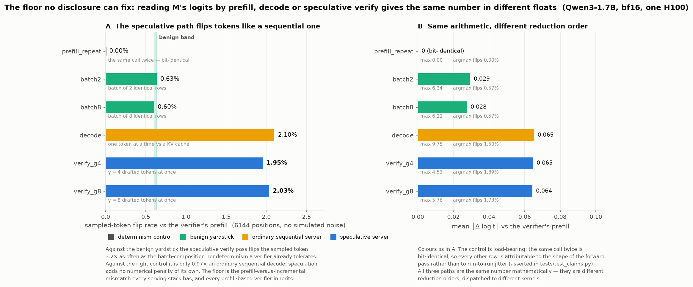

# When the *provider* speculates

*An honest speculative-decoding server is flagged by the repo's strongest detector
at 94.5%, and the sound fix costs more than the generation it audits. Ties together
`ivgym/spec_server.py`, `ivgym/backends/hf_gpu_spec.py`, and the three measurements
in `experiments/exp_spec_decode_difr_gpu.py` / `exp_spec_aware_verifier_gpu.py` /
`exp_spec_batch_numerics_gpu.py`.*

Everywhere else in this repo speculative decoding is a **verifier** tool: the client
drafts with a proxy it owns and reads the acceptance rate as `1 − TV(p, q)`
([SPEC_DECODING_AND_PROXY_DETECTION.md](SPEC_DECODING_AND_PROXY_DETECTION.md)). This
document is the other half, and it cuts the other way — it is a *problem* for
verification, not a tool for it.

---

## The claim under test

`token_difr` is the repo's strongest detector, and the one the README calls the
clean case for recomputation: against a wrong seed it reads AUC 1.000. Its
guarantee is not "the provider sampled from `p`". It is "the provider sampled from
`p` **via this exact map**":

```
t = argmax( filt(logits) + T · g ),    g = Gumbel(position_seed(...))
```

Provider and verifier draw the same `g` from a public per-position seed, so for an
honest provider the margin is 0 up to numerical noise.

A speculative-decoding server samples from the same `p` via a *different* map. It
proposes `x ~ q` from a small draft model, accepts with probability
`min(1, p(x)/q(x))`, and otherwise draws from the normalized residual `(p − q)₊`.
The marginal law is **exactly** `p` — the two-line proof is in `spec_server.emit_token`
and `tests/test_spec_server.py` Monte-Carlos it on CPU — but the emitted token is a
function of the *draft's* randomness and the server's acceptance uniforms, which
the verifier does not hold and cannot reconstruct.

So the honest server is, to `token_difr`, the same *kind* of object as
`attacks.WrongSeed`. That is a prediction with a number attached, and this is the
number.

**Nothing here is simulated.** Two real models, real KV caches, a real batched
target verify pass, one H100. Target `M` = Qwen3-1.7B, draft = Qwen3-0.6B,
γ = 4, 48 prompts × 128 tokens per arm, 5 protocol seeds, scored under the one
standardized protocol (`harness.EvalConfig`: pAUC @ FPR ≤ 0.5%, out-of-sample
threshold, batch/pool ratio 10.0% — at the enforced ceiling, not over it).
The honest speculative arm shares the honest arm's model instance, prompts,
tokenization, benign-noise scale and `SamplingSpec`; the *only* difference is how
randomness maps to tokens.

---

## 1. The false positive (`exp_spec_decode_difr_gpu`)

The server really speculates: honest exact speculation emits **2.95 tokens per
target verify pass** at γ = 4, i.e. a 2.95× reduction in target forward passes.
This is a server with a commercial reason to exist, not a strawman.

Flag rate at a threshold calibrated to 0.5% FPR on honest traffic. For the three
honest arms this is a **false-positive rate**:

| arm | `token_difr` | `cross_entropy` | `token_toploc` | `activation_difr` |
|---|---|---|---|---|
| `honest_null` *(honest)* | 0.0% | 21.2% | 0.3% | 0.1% |
| `honest_spec` *(honest)* | **94.5%** | 0.9% | 0.2% | 0.5% |
| `honest_spec_seeded` *(honest)* | **98.9%** | 8.3% | 1.3% | 0.0% |
| `spec_lenient` *(cheat)* | 99.1% | 14.6% | 0.8% | 0.0% |
| `spec_topk` *(cheat)* | 100.0% | 100.0% | 100.0% | 0.0% |
| `seed_43` *(cheat)* | 96.8% | 2.5% | 1.1% | 0.0% |
| `quant_2bit` *(cheat)* | 37.9% | 5.8% | 32.8% | 100.0% |

`token_difr` flags an honest speculative provider at 94.5% and a *cheating* one at
99.1%. The detector is not distinguishing honest from dishonest; it is
distinguishing sequential from speculative.

**One caveat, reported rather than buried.** `honest_null` is the same honest
config on a disjoint prompt range, so its row is the protocol's own calibration
check. `cross_entropy` fails it (21.2% ≫ the nominal 0.5%): that column's threshold
does not transfer across prompt ranges, so its speculative rows measure prompt
difficulty as much as speculation. The other three columns are within tolerance and
their rows can be read as false-positive rates. The experiment prints this check
itself and names the failing column.

### The mechanism, stated without a threshold or a metric

Read the claimed tokens against the recomputed reference **without** the seed, then
with it:

| arm | mean NLL under `M` | mean rank in `M` | seed replay agrees | mean margin |
|---|---|---|---|---|
| `honest` | 0.742 ± 0.014 | 1.021 ± 0.057 | 97.5% | 0.177 |
| `honest_spec` *(honest)* | 0.728 ± 0.014 | 0.996 ± 0.052 | **72.1%** | 0.782 |
| `seed_43` *(cheat)* | 0.760 ± 0.014 | 1.074 ± 0.057 | **70.3%** | 0.827 |

The seed-free columns say the honest speculative server's tokens are ordinary draws
from `M` — indistinguishable from the honest sequential server's. The seeded columns
say the replay reproduces 97.5% of the sequential server's tokens, only 72.1% of the
honest speculative server's, and 70.3% of the wrong-seed **attack's**. What
`token_difr` reports is a break in **seed synchronisation**, not in the distribution
the tokens were drawn from.

### What tolerating speculation costs

If a provider is *allowed* to speculate, `token_difr` must be dropped, and the
verifier keeps only the seed-free portfolio:

| attack | best AUC (all 4) | best without `token_difr` | cost |
|---|---|---|---|
| `spec_lenient` | 0.993 (`token_difr`) | 0.531 (`cross_entropy`) | **0.462** |
| `seed_43` | 0.982 (`token_difr`) | 0.511 (`token_toploc`) | **0.471** |
| `spec_topk` | 1.000 (`token_difr`) | 1.000 (`token_toploc`) | 0.000 |
| `quant_2bit` | 1.000 (`activation_difr`) | 1.000 (`activation_difr`) | 0.000 |

The two attacks that *preserve the served distribution* are exactly the two that
cost half an AUC. Forward-pass cheats are unaffected, because `activation_difr`
reads activations before a token is drawn and does not care how one was picked.



**This is the finding, and it is a scope limit on the README's central claim.** The
portfolio recommendation survives against deviations that change the distribution.
Against output-preserving deviations it depended entirely on `token_difr`, and
`token_difr` requires the provider not to speculate — an assumption no client can
check, about a technique most serving stacks already use.

---

## 2. Can the verifier be taught to speculate? (`exp_spec_aware_verifier_gpu`)

Four rungs, each a strictly stronger disclosure requirement on the provider.

**V1 `spec_accept`** — rerun the *attested* draft model and ask a seed-free
question: how hard would it have been to accept the claimed token,
`−log min(1, p(t)/q(t))`? One prefill of each model, no round structure, no
randomness. It cannot false-positive on honest speculation by construction. It also
sees nothing: d′ ∈ [−0.025, −0.004] on every arm, AUC 0.500–0.501, and its binary
form (V1b) passes 95.5% of the wrong-seed attack's tokens against 95.5% of honest
ones. It is a *distributional* check, and preserving the distribution is precisely
what an output-preserving deviation does.

**V2 `spec_replay`** — re-run the whole speculative loop: draft rollout, batched
target verify, accept/reject at the **public** per-position uniforms, and check it
reproduces the claimed tokens. This is sound. It requires the provider to (a) derive
all its randomness from the public seed, (b) attest the draft model, (c) disclose γ.

**V3 `trust_declared`** — believe the provider's assertion about what it proposed.
Certifies 100% of every server's tokens without a forward pass, and not because the
servers are honest: a provider asserting `draft = claimed` may name any draft
probability `q̂ ≤ p(t)/u`, forcing acceptance for every token with `p(t) > 0`. Not
measured, because it is arithmetic. The disclosure has to be **recomputed, not
believed**.

### Each verifier is sound only against the algorithm it assumes

Share of a server's tokens each replay verifier **cannot** reproduce:

| server | V0 Gumbel rerun | V2 spec replay |
|---|---|---|
| `honest` (sequential) | **2.5%** | 39.6% |
| `honest_spec_seeded` | 30.6% | **4.4%** |
| `honest_spec` (own RNG) | 27.9% | 38.7% |
| `seed_43` | 29.7% | 41.8% |
| `spec_lenient` | 30.9% | 42.6% |

Read the diagonal. V0 reproduces the sequential server and fails on the speculative
one; V2 reproduces the seeded speculative server and fails on the sequential one.
**Neither is a verifier for a provider whose decoding algorithm the client does not
know** — and which algorithm a provider runs is exactly what a client cannot check.

At the batch level those off-diagonal shares are total losses: V2 flags the honest
sequential server at **100%**, and the honest speculative server that draws its own
randomness (`honest_spec`) at **100%** as well. V2's soundness is bought with a
change to the **server** — "derive your acceptance uniforms from the public seed" —
not with cleverness in the verifier. A verifier that must be told the provider's
decoding algorithm and RNG discipline in advance is a contract, not a check.

### The two prices

**Noise.** V2's honest floor is 4.4% disagreement, against 2.5% for V0 on its own
null. The replay must itself run the draft rollout and the batched verify pass, and
its forward passes do not have the shapes the server's did, so a share of acceptance
decisions flip on numerics alone. The sound fix is **noisier than the detector it
replaces**.

**Compute.** Per audited sequence, GPU-synchronised:

| rung | what it does | cost |
|---|---|---|
| V0 `token_difr` | one prefill over `[prompt + claimed]` | 394.9 ms |
| V2 `spec_replay` | replay the speculative loop | **4669.1 ms (11.8×)** |

V2 is not a prefill. It replays ~32 sequential rounds, each a 4-step draft rollout
plus a batched target pass, because the round structure is only knowable by walking
it. **The sound spec-aware audit costs more than the generation it is checking**,
where plain recomputation costs one prefill — and the whole economic argument for
recomputation-based verification is that auditing is cheaper than generating.



---

## 3. The part no disclosure can fix (`exp_spec_batch_numerics_gpu`)

Everything above is bookkeeping: in principle a provider could disclose its draft
tokens and acceptance uniforms and a spec-aware verifier could replay the decision.
This experiment isolates a mechanism that bookkeeping cannot reach.

Reading `M`'s logits at generated position `j` can be done three ways:

```
prefill   one forward over [prompt + claimed], read row L-1+j    <- THE VERIFIER
decode    feed tokens one at a time against a KV cache           <- an ordinary server
verify    feed gamma drafted tokens at once against a KV cache   <- a SPECULATIVE server
```

All three are the same number mathematically. None is the same float: they are
different reduction orders over the same arithmetic, dispatched to different kernels
because the sequence-length dimension differs. Simulated noise is switched off
entirely (`verifier_sigma = act_benign_sigma = benign_sigma = 0`), so every number
below is real bf16-on-H100 arithmetic. 6144 positions, identical prefixes.

| path | mean │Δlogit│ | max │Δlogit│ | argmax flip | sampled-token flip | mean margin |
|---|---|---|---|---|---|
| `prefill_repeat` *(control)* | 0.000e+00 | 0.000e+00 | 0.00% | **0.00%** | 0.0000 |
| `batch2` *(yardstick)* | 2.935e-02 | 6.344e+00 | 0.57% | 0.63% | 0.0447 |
| `batch8` *(yardstick)* | 2.754e-02 | 6.219e+00 | 0.57% | 0.60% | 0.0502 |
| `decode` | 6.518e-02 | 9.750e+00 | 1.50% | 2.10% | 0.1078 |
| `verify_g4` | 6.464e-02 | 4.531e+00 | 1.89% | 1.95% | 0.1412 |
| `verify_g8` | 6.428e-02 | 5.758e+00 | 1.73% | 2.03% | 0.1408 |

The control is load-bearing: the same call twice is **bit-identical**, so every
other row is attributable to the shape of the forward pass rather than to
run-to-run jitter. (`tests/test_claims.py` asserts this; if it ever stops holding,
the table means nothing.)

**Against the benign yardstick**, the speculative verify pass flips the sampled
token at 2.03% versus 0.63% for the batch-composition nondeterminism a verifier
already tolerates — **3.2×**.

**Against the right control**, the result is narrower and more interesting: an
*ordinary sequential* server already flips 2.10%, and the speculative verify pass
flips 2.03% — **0.97× decode**. Speculation adds no measurable numerical penalty of
its own. The floor is the **prefill-versus-incremental** mismatch that every serving
stack has and every prefill-based verifier inherits. Speculation does not create it;
a spec-aware verifier simply cannot escape it, which is why V2's honest floor sits at
4.4% and not at 0.



---

## What this changes

1. **`token_difr`'s soundness assumption is stronger than advertised.** It needs
   the provider to sample via the verifier's exact Gumbel map — not merely to sample
   from `p`. Speculative decoding satisfies the second and violates the first, and
   it is standard practice.
2. **The portfolio recommendation has a scope limit.** Against a provider allowed to
   speculate, the seed-free portfolio loses ~0.47 AUC on output-preserving
   deviations (`seed_43` → 0.511, `spec_lenient` → 0.531 — i.e. chance) and loses
   nothing on forward-pass ones. Forward-pass cheats stay caught by
   `activation_difr` at 1.000.
3. **Seed synchronisation is a protocol requirement, not a free assumption.** A
   deployment that wants `token_difr` must contract for it — "derive sampling
   randomness from this public seed, and do not speculate" — and that is a
   restriction on the provider's serving stack with a real throughput cost (2.95×
   fewer target passes, given up).
4. **`token_toploc` gets a new argument in its favour and a new limit.** It needs no
   seed synchronization, so it is untouched by all of this (0.2% FPR on
   `honest_spec`). But it is also at chance on the deviations that
   speculation-tolerance forces `token_difr` to give up.
5. **The sound fix inverts the economics.** V2 is 11.8× a prefill and noisier than
   V0. If a client must tolerate speculation *and* wants to catch output-preserving
   deviations, the honest statement is that no cheap option in this repo does it.

## What is not measured here

- **One (target, draft) pair, one γ.** The 0.496 draft-acceptance rate (2.95
  tokens/round) sets how much of the trace is drafted; a closer draft would raise it
  and a distant one lower it. The direction of every conclusion is set by *whether*
  the randomness path differs, not by how often, but the levels are one-pair
  measurements.
- **The draft model is attested.** V1/V2 assume the client knows which draft model
  the provider used. A provider free to choose its draft is strictly stronger.
- **No adaptive attacker.** `spec_lenient` and `spec_topk` are fixed cheats, not
  configurations optimized against the verifier they face. Item 3 of
  [NEXT_EXPERIMENTS.md](../NEXT_EXPERIMENTS.md) is the version of this that matters:
  an attacker with query access would search for a speculative configuration that
  hides *inside* the honest speculative false-positive band, which this line of work
  has just shown to be wide.

## Reproduce

```bash
IVGYM_PROMPTS=48 IVGYM_TOKENS=128 .venv/bin/python -m experiments.exp_spec_decode_difr_gpu
IVGYM_PROMPTS=48 IVGYM_TOKENS=128 .venv/bin/python -m experiments.exp_spec_aware_verifier_gpu
IVGYM_PROMPTS=48 IVGYM_TOKENS=128 .venv/bin/python -m experiments.exp_spec_batch_numerics_gpu
python tests/test_spec_server.py     # the distribution-preservation proof, on CPU
python -m experiments.plot_spec_providers   # the three figures, from the artifacts
```

Artifacts: `docs/results/spec_decode_difr.json`, `spec_aware_verifier.json`,
`spec_batch_numerics.json`; logs under `docs/results/logs/spec_*_n48_t128.log`.
Wall clock on one H100: ~32 min, ~41 min, ~8 min. The figures are
`docs/figures/fig_spec_provider_fpr.png`, `fig_spec_aware_verifier.png`,
`fig_spec_batch_numerics.png`; `experiments/plot_spec_providers.py` reads only the
committed JSON, so it needs no GPU and every number in it traces to a table above.
