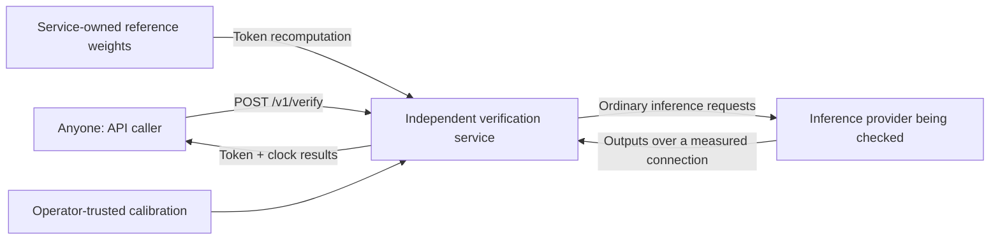

# Independent token and clock verification service

IVGym now exposes the token and clock verifiers from the experiments as an HTTP
service. The API caller submits a provider target or captured evidence. A third
party operates the service, holds its own reference models and calibration, and
returns detector scores and applicable decisions. The inference provider does
not run the verifier and does not need IVGym receipt middleware.



This separation is an explicit code boundary:

| Component | Responsibility | Trust |
|---|---|---|
| Requester | Supplies a target, prompts, claimed settings or captures | Submitted captures are client-reported |
| `service/provider.py` | Calls the provider and timestamps streamed output | Provider output and metadata are untrusted |
| `backends/reference.py` | Scores returned prefixes with the service's pinned model | Controlled by the independent verifier |
| `service/engine.py` | Calls existing detectors and applies configured calibration | No provider logits or caller-supplied null accepted |
| `service/app.py` and `jobs.py` | Public API, validation and bounded GPU queue | No public endpoint can replace reference models or calibration |

## Start the API on this H100

```sh
python -m venv --system-site-packages .venv
.venv/bin/pip install -e '.[service,gpu,test]'
.venv/bin/ivgym serve --config examples/service.h100.json --port 8000
```

The service is at `http://127.0.0.1:8000`, with interactive API documentation at
`/docs` and a machine-readable schema at `/openapi.json`. `python -m ivgym serve`
is equivalent. Use `--host 0.0.0.0` when deliberately exposing the service to your
network. The API has no caller authentication requirement: anyone who can reach
it can submit requests. Configure the network/TLS boundary for a hosted service.

The H100 example points to the checkpoint already downloaded on this machine.
On another machine, set `snapshot` to its locally installed immutable snapshot.
The service operator configures model IDs, reference paths, enabled provider base
URLs, calibration, and limits. Requesters cannot supply reference code, weights,
logits, filesystem paths, or honest-score pools.

`ivgym serve` now starts the verifier. The earlier receipt-provider experiment is
available as `ivgym artifact-provider`; see the
[artifact experiment guide](AUDIT_IMPLEMENTATION.md). Artifact signatures are not
required to call the new service.

## API requests

| Endpoint | Purpose |
|---|---|
| `POST /v1/verify` | Submit a request and wait for the result |
| `POST /v1/verifications` | Queue the same request; returns HTTP 202 and a status URL |
| `GET /v1/verifications/{id}` | Poll queued/running/succeeded/failed status and result |
| `GET /v1/models` | Discover reference model IDs, detectors and enabled providers |
| `GET /v1/calibrations` | Inspect operator-installed calibration designs and provenance |
| `GET /health` | Check service availability; this does not force a model load |

### Verify a live provider

Edit [the live example](../examples/verify-live.json) with the target's base URL,
provider model name, and prompts. Its URL must be enabled in the service's
`allowed_provider_urls`; this restricts outbound targets, not who may submit
verification requests. A provider credential can be supplied as `target.api_key`.
It is forwarded to that provider, not used as a service credential or returned in
results.

```sh
curl http://127.0.0.1:8000/v1/verify \
  -H 'Content-Type: application/json' \
  --data-binary @examples/verify-live.json
```

`model` selects the independent reference. `target.model` is the model name sent
to the provider. The service sends the token prompts and alternating short/long
clock probes, captures the output, measures arrival times with its own monotonic
clock, and scores independently. It never asks the target for trusted reference
logits or an honest baseline.

The initial adapter uses OpenAI-compatible **streaming `/completions`** with raw
prompts. Chat endpoints, hidden system prompts and provider-specific preprocessing
need separate adapters. Ordinary SSE text is supported: the token checks are
labeled `retokenized_text`, and event timing is labeled `sse_chunk`. Exact prompt
and output token-ID extensions enable `exact_ids` and, when every event contains
one token, `token` timing. A multi-token chunk is never silently treated as one
GPU token. Buffered arrivals remain client-observable timings, not GPU events.

### Verify captured tokens

```sh
curl http://127.0.0.1:8000/v1/verify \
  -H 'Content-Type: application/json' \
  --data-binary @examples/verify-tokens.json
```

Prefer a capture containing `prompt_token_ids` and `output_token_ids` when these
are available. Otherwise supply `prompt` and `output` text. The latter is scored
as reconstructed text; re-tokenization cannot establish the provider's exact
original token sequence. Each capture supports a `prompt_id` and explicit
sampling settings at the request level.

### Verify captured clock evidence

```sh
curl http://127.0.0.1:8000/v1/verify \
  -H 'Content-Type: application/json' \
  --data-binary @examples/verify-clock.json
```

The example timings are illustrative, not a calibration bundle. Supply paired
short/long inter-token or event intervals in milliseconds, context lengths and
the measurement unit. Clock-only captured verification needs no GPU or model
load. Both token captures and timing pairs can be included in one request.
Captured timestamps always remain `client_reported`; only a live service
measurement is `service_observed`.

For longer jobs, send the same JSON to `/v1/verifications`, then poll the returned
`status_url`. Jobs use one worker to serialize access to the H100. The configured
pending limit includes the running job; a full queue returns HTTP 429. Results
are retained in memory for the configured TTL and may be evicted under retention
limits. They do not survive a restart. Job IDs are unguessable access links;
there is no endpoint listing everyone's jobs. The service stores neither raw
prompt bodies nor provider credentials in returned job records.

## The existing detectors, exposed directly

| API name | Existing implementation | Evidence |
|---|---|---|
| `token_difr` | `ivgym.verifiers.TokenDiFR` | Clipped post-Gumbel logit margin |
| `cross_entropy` | `ivgym.verifiers.CrossEntropy` | Unfiltered reference NLL at the claimed temperature |
| `token_toploc` | `ivgym.verifiers.TokenTOPLOC` | Token rank, capped at 50, after the existing top-k/top-p filtering |
| `clock_slope` | `ivgym.clock.ClockSlope`, extracted from the timing experiment | Negative long-minus-short interval difference |

The token scorer constructs `VContext` over the service's teacher-forced logits
and calls the original detector's `evidence` method. This uses the original
capped rank, not the log-rank feature introduced in the earlier artifact MVP.

`token_difr` requires exact IDs and a declared
`sampler_contract: "ivgym_numpy_gumbel_v1"` on each capture or live target. This
is the repository's NumPy Gumbel generator plus `position_seed(seed, prompt_id,
position)`. Matching a seed number alone does not reproduce a different serving
engine's RNG. Without the contract, DiFR is `unsupported` while seed-free token
checks can still run. The declaration is a claimed sampler contract, not an
attestation of provider internals. Activation verification is not exposed because
an ordinary endpoint does not provide the required evidence.

The clock score is exactly the statistic in the earlier context-slope experiment:

```
D = ITL(long context) - ITL(short context)
score = mean(-D)
```

A truncating provider tends to reduce `D`, increasing the anomaly score. Device
traces, service-observed token arrival times and SSE chunk gaps require separate
calibration. Queueing, buffering, load and intentional padding can affect the
score. The API does not apply the old device-side H100 baseline to an arbitrary
internet endpoint.

## Results and calibration

A successful HTTP call returns `outcome`, per-verifier `score`, `sample_count`,
`p_value`, `threshold`, `reason` and a `design` describing the measured input.
It also reports the three parties, evidence provenance, reference identity,
reference-prefill cost and elapsed time. Set `include_token_scores: true` to
include the original per-token score arrays.

A score is available without calibration, but a pass/fail conclusion is not
invented. With no matching operator-owned profile the result is `inconclusive`
with `no_applicable_calibration`. Each configured profile contains a unique ID,
an exact `design`, honest complete-request aggregate scores by nuisance
condition, and provenance. These profiles are loaded from the service config;
there is deliberately no public API to redefine the honest null.

To provision profiles, the **service operator**, outside the public API, runs:

```sh
.venv/bin/ivgym calibrate --config examples/service.h100.json \
  --request trusted-control-request.json --blocks 128 \
  --provenance 'Adopter-controlled honest provider; fixed serving and traffic profile' \
  --out runs/trusted-control-calibration.json
```

The request has the same JSON schema as a live verification request, but points
to a control whose honest configuration the operator independently trusts. The
command makes fresh live requests and groups their aggregate scores by design;
it refuses to manufacture a null by repeatedly scoring submitted captures.
Install the resulting file through `calibration_files` in the service config
(paths are relative to that config), then restart the service. With all four
detectors and alpha 0.05, each matching condition needs at least 79 complete
blocks even to attain the Bonferroni threshold. Different output lengths or
measurement designs form separate profiles and each needs sufficient data.

For a matching profile, the service uses a conservative upper-tail rank p-value
per condition, takes the maximum across conditions, and applies Bonferroni over
all requested detectors. Profiles with inadequate p-value resolution remain
inconclusive. Matching a design verifies declared measurement characteristics,
not representative traffic or exchangeability; valid deployment calibration is
still the operator's responsibility. The earlier audit pilot's calibration is
not reused because it uses different detector transforms and block design.

The combined outcomes are `inconsistent`, `no_deviation_detected`, `inconclusive`
and `unsupported`. Missing evidence cannot become a passing detector. Provider
transport failures produce structured HTTP errors or failed jobs, not statistical
accusations. Syntax, dimensions, finite values, context ordering, output limits,
request size and prefill budgets are checked before the relevant work.

## Tested on this H100

The [service integration report](results/verification_service_h100.md) records
**135 passing tests** and **nine H100 API cases** with provider and verifier in
separate processes. A service-owned control profile produced
`no_deviation_detected` for an honest live request and `inconsistent` for a real
temperature override. The clock statistic matched the original experiment arrays
exactly. This verifies the implementation, not a deployment operating point.

## Test and reproduce

```sh
.venv/bin/python -m pytest tests/test_service.py -q
.venv/bin/python -m pytest tests/ -q
.venv/bin/python -m experiments.exp_verification_service_gpu \
  --snapshot /workspace/model-cache/models--Qwen--Qwen3-0.6B/snapshots/c1899de289a04d12100db370d81485cdf75e47ca \
  --out runs/service-h100-new
```

The GPU integration test starts provider and verifier in separate processes. It
posts the earlier real BF16/temperature/NF4 captures and clock experiment traces,
checks clock-statistic parity, makes fresh live requests, and tests queued jobs.
The local test provider in `experiments/service_demo_provider.py` is test support;
it is not part of the independent verification service or a deployment requirement
for providers. The old audit captures must be available in `runs/audit-h100`, as
in this workspace; the published archive can restore them under `runs/`.
