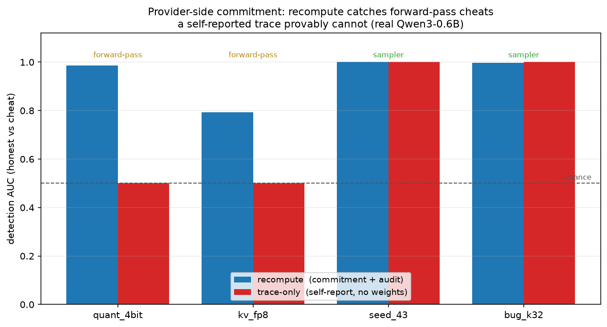

# vLLM provider-side PR: inference-commitment (uncheatable by construction)

**Status:** proposal + concrete patch surface + **reference implementation,
measured on a real model** (§8). Supersedes the toy numpy provider in
[`model.py`](../model.py)/[`protocol.py`](../protocol.py), which existed only to
measure the economics (see [MVP_PROTOCOL.md](MVP_PROTOCOL.md)). The provider-side
commitment is implemented in [`ivgym/commitment.py`](../ivgym/commitment.py) (the
exact code the PR drops into vLLM) and validated end-to-end against real
Qwen3-0.6B by [`experiments/exp_commitment_vllm.py`](../experiments/exp_commitment_vllm.py).
This document specifies the **real provider** — a small, opt-in change to vLLM —
argues *why it cannot be cheated*, and (§8) **proves it** with a measurement.

---

## 1. The trap: you cannot verify inside the provider

The provider is the untrusted party. That single fact rules out most of the
obvious PRs:

- **"Add a `verify()` to vLLM."** The provider runs the binary. It can disable,
  short-circuit, or fake the verifier. A checker the accused controls is not a
  checker.
- **"Have vLLM emit an auditable trace it self-reports"** (the speculative-decode
  trace idea). This catches *procedure* cheats (over-acceptance, coin-fudging)
  because they break a trace-internal invariant. But a **forward-pass** cheat —
  quantized weights, fp8, half the layers, stolen weights — corrupts the
  *logits themselves*; the provider then runs textbook sampling on the corrupted
  logits and reports a **perfectly self-consistent** trace. Every no-recompute
  check passes. So trace-emission is **partially cheatable, exactly on the
  forward pass** — the deviation this whole project cares most about. (This is
  the recompute-dominant boundary the DiFR detectors hit.)

**Conclusion:** the provider-side PR must contain **zero verification logic** —
nothing to stub, disable, or feed fake inputs to. Its only job is to **bind**
what it actually served. All catching happens *outside* vLLM, in a
re-computation by the party that owns the weights.

---

## 2. Design principle: vLLM commits, the weight-owner recomputes

Split the protocol so that the untrusted side does the one thing it *can* be
forced to do honestly (commit), and the trusted side (the model owner — e.g. the
lab whose weights are being served) does the thing that can't be faked
(recompute the real model):

```
 vLLM (untrusted)                         weight-owner / auditor (trusted, has M)
 ────────────────                         ────────────────────────────────────────
 serve request under spec ϕ               after each signed root is published:
   with a per-request seed s        ──▶     pick a random q-fraction of requests
 leaf = H(model, prompt, output,                (audit set chosen AFTER root fixed)
          s, canonical(ϕ))                 for each: re-run REAL M teacher-forced
 accumulate leaves → Merkle tree                over prompt+output under ϕ, seed s
 SIGN + PUBLISH root each epoch     ──▶     DiFR-score committed output vs recompute
 return opening (leaf, path, epoch)              flag if divergence > τ
```

vLLM's PR is the **left column only**. It never scores anything. There is no
"honest path" and "verify path" for a cheater to diverge — there is one path that
emits a binding commitment, and the commitment is over the tokens the user
actually received.

**Why this is uncheatable — every provider lie has a detectable consequence:**

| Provider cheat | Why the commitment can't hide it |
|---|---|
| Quantized / fp8 / fewer-layer / **stolen** weights | Auditor recomputes with the **real** M (which the provider cannot fabricate). The committed output tokens are inconsistent with real-M logits → DiFR margin flags. This is the case trace-emission misses. |
| Biased / stubbed sampler | The **committed seed** lets the auditor reconstruct the exact Gumbel noise; the sampled token must be the seed-consistent argmax under real-M logits. A biased sampler diverges. |
| Commit honest, **serve cheap** to the user | The leaf is over the **delivered** output and the **opening is returned to the user** in the response. The user's opening must verify against the signed root. If vLLM commits anything other than what it delivered, the user's own transcript fails inclusion → dispute. |
| Predict the audit set, swap a leaf afterward | The **signed Merkle root is published before** the auditor draws its random subset. Any post-hoc swap changes a leaf → changes the root → signature/root mismatch. |
| Forge the authentication path at audit time | Path is checked against the **signed** root; a forged path doesn't hash to it. |
| Disable/stub the emitter | Then there is **no signed root** for that traffic. "No commitment" is itself the audit failure — the client contractually refuses to trust uncommitted responses (same posture as certificate transparency). |

Nothing in this table trusts a value vLLM *computed*. The seed and sampling
params are **inputs**; the output tokens are **what the user holds**; the hash and
signature are standard crypto. That is what "not cheatable" means here: the
soundness rests on external recompute of the real weights, not on the provider's
self-report.

---

## 3. What the PR actually adds to vLLM

Three small, opt-in pieces. **None of them touch the sampling hot path's numerics
or add a verifier.**

### 3.1 Reproducible seeded sampling (contract, mostly already present)
vLLM v1 already creates a per-request `torch.Generator` from
`SamplingParams(seed=…)` and stores it in `SamplingMetadata.generators`, using the
Gumbel-max trick for sampling. The PR:
- **auto-assigns a per-request seed** when commitment is enabled and the caller
  didn't supply one, and records it;
- **pins and documents the noise derivation** (generator → `exponential_()` →
  Gumbel-max, with the top-k/top-p ordering) as a stable "sampling spec version"
  so an independent verifier (`ivgym.sampling`) can reconstruct identical noise.

Note: this does **not** require bit-exact determinism. DiFR is explicitly
"verification *despite* nondeterminism" — the auditor scores divergence against a
tolerance `τ` calibrated to the honest hardware-noise floor, so residual
cross-hardware non-determinism is absorbed by `τ`, not fought. The seed is needed
only to reconstruct the *sampling* decision, not to force bitwise equality.

### 3.2 `CommitmentEmitter` (new, opt-in) — the only real new logic
An append-only Merkle accumulator invoked once per **finished** request in the
output path. Per request it forms

```
leaf = SHA256( model_id ‖ spec_version ‖ prompt_token_ids ‖ output_token_ids
               ‖ seed ‖ canonical(sampling_params) )
```

Note there are **no logits in the leaf** — soundness comes from the auditor
*recomputing* logits from the real model, so the provider need not (and, for
soundness, is not trusted to) store them. (An optional quantized-logit hash may be
added purely as an audit *accelerator* — it lets a cheap first-pass skip full
recompute when it already matches — never as a source of trust.)

Every epoch (N requests or T seconds), the emitter builds the tree, **signs the
root** (Ed25519) and publishes it to an append-only sink (file / stdout /
transparency log). It returns each request's **opening** — `(leaf_index,
epoch_id)` and, on request, the authentication path — so the user/auditor can
prove inclusion later.

### 3.3 Opt-in wiring
A server flag `--enable-inference-commitment` (+ `--commitment-signing-key`,
`--commitment-epoch`) and a `commitment` field on `RequestOutput`. Off by default;
zero overhead when off.

---

## 4. Concrete patch surface (vLLM v1)

Anchor points are the current v1 modules; **pin exact paths to the target release
tag** before filing — v1 internals move. The design is deliberately confined to
the *output* path and server args, so it survives sampler refactors.

```diff
# vllm/engine/arg_utils.py  (or entrypoints/openai/cli_args.py)
+    # --- inference commitment (provider-side binding for external audit) ---
+    parser.add_argument("--enable-inference-commitment", action="store_true",
+        help="Emit a signed Merkle commitment over (prompt, output, seed, "
+             "sampling params) per request. Adds no verification; enables "
+             "external recompute-based auditing.")
+    parser.add_argument("--commitment-signing-key", type=str, default=None)
+    parser.add_argument("--commitment-epoch", type=int, default=1024,
+        help="Requests per signed Merkle root.")
```

```python
# vllm/entrypoints/commitment.py   (NEW — the only new logic; no verification)
import hashlib, json
from dataclasses import dataclass
# ed25519 via cryptography / pynacl

def _canon(sp) -> bytes:
    keys = ("temperature","top_p","top_k","min_p","repetition_penalty",
            "presence_penalty","frequency_penalty","seed","max_tokens")
    return json.dumps({k: getattr(sp, k, None) for k in keys},
                      sort_keys=True, separators=(",",":")).encode()

def leaf_hash(model_id, spec_version, prompt_ids, output_ids, seed, sp) -> bytes:
    h = hashlib.sha256()
    for part in (model_id.encode(), spec_version.encode(),
                 bytes(memoryview(_i32(prompt_ids))), b"|",
                 bytes(memoryview(_i32(output_ids))), b"|",
                 str(seed).encode(), b"|", _canon(sp)):
        h.update(b"\x00"); h.update(part)
    return h.digest()

@dataclass
class Opening:            # returned to the caller in RequestOutput.commitment
    leaf_index: int
    epoch_id: int

class CommitmentEmitter:
    """Append-only Merkle accumulator + signed-root publisher. NEVER verifies."""
    def __init__(self, model_id, spec_version, signing_key, epoch, sink):
        self._buf = []; self._epoch = epoch; self._epoch_id = 0
        self._model_id, self._spec = model_id, spec_version
        self._sk, self._sink = signing_key, sink
    def record(self, prompt_ids, output_ids, seed, sp) -> Opening:
        leaf = leaf_hash(self._model_id, self._spec, prompt_ids, output_ids, seed, sp)
        self._buf.append(leaf)
        op = Opening(leaf_index=len(self._buf)-1, epoch_id=self._epoch_id)
        if len(self._buf) >= self._epoch:
            self._seal()                    # build tree, SIGN root, publish, reset
        return op
    def _seal(self):
        root = merkle_root(self._buf)
        sig  = self._sk.sign(bytes(str(self._epoch_id).encode()) + root)
        self._sink.publish(self._epoch_id, root, sig)   # append-only / transparency log
        self._buf = []; self._epoch_id += 1
```

```diff
# vllm/v1/engine/output_processor.py   — per finished request, in the output path
+        if self.commitment is not None and req_state.is_finished:
+            output.commitment = self.commitment.record(
+                prompt_ids=req_state.prompt_token_ids,
+                output_ids=req_state.output_token_ids,
+                seed=req_state.sampling_params.seed,
+                sp=req_state.sampling_params)
```

```diff
# vllm/outputs.py
 class RequestOutput:
+    commitment: Optional["Opening"] = None   # binding for external audit; None if disabled
```

The client/auditor side is **not** vLLM — it is [`ivgym`](../README.md):
`ivgym.sampling` reconstructs the seeded Gumbel noise, the HF/vLLM verify pass
recomputes reference logits over `prompt+output`, and an `ivgym.defenses`
detector (Token-DiFR margin) scores divergence. The MVP's `commit.py` Merkle
verify becomes the inclusion check against the signed root.

---

## 5. What it costs — and why the provider will accept it

- **Provider runtime cost:** one SHA-256 over a few hundred token-ids per request
  + one Merkle tree per epoch + one signature per epoch. Negligible vs. a forward
  pass; **no logit storage, no extra GPU work.** Off by default.
- **Auditor cost:** unchanged from the MVP economics — recompute only a random
  `q`-fraction. `audit_count = ln(1/(1−P)) / (f·(1−δ))`, **independent of traffic
  volume** (MVP Phase 3), at `β ≈ 1` recompute cost per audited request. Catching
  99% of a 1%-cheater ≈ 0.05% of full re-execution (MVP Phase 4).
- **Why a provider ships it:** it is the *provider's* liability shield too — a
  signed commitment lets an honest provider *prove* it served correctly, and
  contains no proprietary data (no weights, no logits).

---

## 6. Assumptions and the honest alternatives

- **The auditor has the real weights `M`.** In the exfiltration threat model this
  is exactly right: the weight owner audits a provider serving its model. If the
  auditor does *not* have `M`, recompute-anchoring doesn't apply and you need one
  of the two alternatives below.
- **Recompute is the trust anchor.** The two ways to make the provider uncheatable
  *without* recompute both cost more and are out of scope for this PR:
  - **TEE / confidential computing** — the GPU/enclave attests that the genuine
    signed binary and weights ran. Uncheatable without recompute, but requires
    trusted hardware and a correct measured boot; the provider still controls the
    host. A natural *complement*: attest the emitter so "no commitment" is
    impossible.
  - **ZK proof of inference** — a succinct proof that the output came from `M(ϕ)`.
    Uncheatable and recompute-free, but not practical at LLM scale today.
- **Availability, not just soundness.** This PR binds *what was served*; it does
  not by itself force the provider to *serve* (a provider can refuse, or withhold
  roots). "No signed root ⇒ untrusted" handles this at the policy layer.

---

## 7. Relationship to the rest of the repo

- [`MVP_PROTOCOL.md`](MVP_PROTOCOL.md) — the numpy model measured the *economics*
  of this exact loop (commit → sample-audit → recompute) with FLOP-exact counts.
  This PR is the real provider that produces the same commitment; the numbers
  carry over.
- [`ivgym`](../README.md) — the **client/auditor** side: seed-synced sampler,
  DiFR detectors, AUC harness. This PR is what feeds it real transcripts.
- The [spec-decode trace](../README.md#speculative-decoding-trace-verification)
  regime is the *cheaper, weaker* cousin: it makes sampler cheats free to detect
  but leaves forward-pass cheats to recompute. This commitment PR is the
  general-decoding, forward-pass-sound design; the two compose (trace as a cheap
  first pass, commitment+recompute as the sound backstop).

---

## 8. Reference implementation and measured results

The provider is implemented for real and measured on **Qwen3-0.6B on an
H100-80GB** — not the toy numpy model. Two files:

- [`ivgym/commitment.py`](../ivgym/commitment.py) — the PR code, portable: canonical
  sampling-param encoding, domain-separated leaf hashing, a Merkle tree,
  **Ed25519-signed roots**, `CommitmentEmitter`, and the client-side
  `verify_inclusion`. It contains **no verification of the model** — by design.
- [`experiments/exp_commitment_vllm.py`](../experiments/exp_commitment_vllm.py) —
  serves every (prompt, config) through the real model, commits each request, seals
  and signs the epoch root **before** any audit, then runs the two auditors and the
  crypto game. Unit tests: [`tests/test_commitment.py`](../tests/test_commitment.py)
  (dependency-free; inclusion / tamper / forged-root / wrong-spec / leaf-swap).

```bash
python tests/test_commitment.py                     # crypto binding (no GPU)
python -m experiments.exp_commitment_vllm           # full proof on real Qwen3-0.6B
```

### 8.1 Claim A — the crypto binding holds (120 committed requests)

| check | result |
|---|---|
| honest openings verify | **120/120 (100%)** |
| tampered outputs rejected | **120/120 (100%)** |
| forged signed-roots rejected | **120/120 (100%)** |
| post-publish leaf-swaps foiled | **93/93 (100%)** |

The 3 remaining cheats produced output **byte-identical** to the honest run, so
their committed leaf is identical — nothing to swap. Those are caught by
*recompute* (logit divergence), not by the commitment, exactly as designed: the
leaf binds *what was served*, and recompute checks *how it was computed*.

### 8.2 Claim B — recompute catches forward-pass cheats a self-report trace cannot

Same committed transcripts, two auditors, **detection AUC (honest vs cheat)** as
a batch statistic (DiFR's mean-over-batch; `batch=1000`, 24×128-token pool):

| attack | axis | **recompute** (commitment + audit) | **trace-only** (self-report, no weights) |
|---|---|---|---|
| `quant_4bit` | forward-pass | **0.985** | **0.500** |
| `kv_fp8` | forward-pass | **0.793** | **0.500** |
| `seed_43` | sampler | 1.000 | 1.000 |
| `bug_k32` | sampler | 0.998 | 1.000 |

The mechanism is visible in the mean per-token margin: for **honest and
forward-pass cheats alike**, the trace-only margin is **exactly 0.000** — the
provider samples correctly from its *own* (quantized) logits, so its self-report
is internally consistent and no trace check can move off chance. Only recomputing
the real weights sees the forward-pass deviation (honest margin 0.102 → quant
0.288). Sampler cheats (`seed_43`, `bug_k32`) *break* self-consistency, so both
auditors catch them — you don't even need recompute there. **This is the
procedure-vs-forward-pass boundary, measured on real logits**, and it is the
whole argument for anchoring on recompute: a self-reported trace is provably
blind to the forward-pass cheat (quant/fp8/stolen weights) this project cares most
about.

Recompute AUC rises with batch size (the DiFR effect) while trace-only stays
pinned at 0.500 on forward-pass — `quant_4bit` recompute climbs `0.52 → 0.79 →
0.99` over batch `1 → 64 → 1000`, and `trace-only` never leaves chance.


### 8.3 Claim C — cost is the MVP's

Measured per-audit recompute on the real model: **~25 ms** (one prefill over
`prompt+output`). Audit count `= ln(1/(1−P)) / (f·(1−δ))` is independent of
traffic volume, so catching 99% of a 1%-cheater is **461 audits ≈ 12 s** of
recompute regardless of how many requests were served — the [MVP](MVP_PROTOCOL.md)
economics, now on a real model behind a real commitment.

---

### Sources
- DiFR: Inference Verification Despite Nondeterminism — https://arxiv.org/pdf/2511.20621
- vLLM custom logits processors (v1 API) — https://docs.vllm.ai/en/latest/features/custom_logitsprocs/
- vLLM reproducibility & per-request seeded generators — https://docs.vllm.ai/en/latest/usage/reproducibility/
