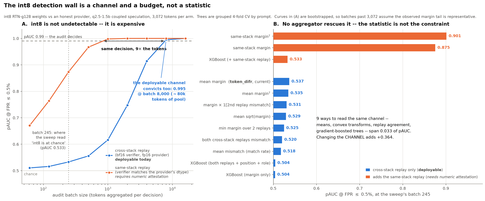

# The int8 wall is an information wall, not an aggregation wall

`specdec_difr_sweep.md` S4 leaves int8 RTN-g128 weights at chance -- `d'` 0.058 on the
match rate, 0.073 on the margin, pAUC 0.518/0.537 at batch 245 -- while int4 is at 1.000.
Before accepting that as a boundary, we owed it one check: maybe the evidence *is* in the
per-token records and `mean(margin)` is just a weak way to read them. 99% of honest tokens
are structural zeros; a mean over a zero-inflated variable is not obviously the right
statistic, and no one had asked whether a nonlinear function of the per-token features
does better.

`experiments/exp_int8_gbt_aggregation.py` asks XGBoost. It re-reads
`specdec_difr_sweep.jsonl` (no GPU rerun), fits gradient-boosted trees on the per-token
features under grouped 4-fold CV by prompt, and compares against hand-built aggregators
on the same pool, batch, and pAUC. Three feature sets:

| set | features | deployable? |
|---|---|---|
| `difr` | margin | yes -- what `verifiers.token_difr` already has |
| `xstack` | margin, mismatch, **a second cross-stack replay** (verifier batch 4), position, speculation role | yes -- verifier's own stack, replayed twice |
| `matched` | `xstack` + the **same-stack** replay (provider's exact fp16 numerics) | no -- upper bound only |

Training needs labelled deviant tokens, which is less circular than it looks: the verifier
can RTN-quantize the claimed weights itself and build its own labelled pool with no
provider cooperation. The `--train int4` arm tests that transfer.

*`experiments/plot_int8_wall.py` -> `docs/figures/fig_int8_wall.png`. (A) is S4's cost
curve; (B) is S1's aggregator table on the same pAUC axis, so the two panels compare
directly. Both panels use one hue per replay channel.*

## 1. The answer: no aggregator helps, because a token carries ~nothing

Per-token AUC, honest vs int8, 3 072 tokens per arm:

| feature | per-token AUC |
|---|---:|
| cross-stack mismatch / margin | 0.5029 / 0.5029 |
| 2nd cross-stack replay (batch 4) | 0.5023 / 0.5023 |
| same-stack mismatch / margin | 0.5039 / 0.5039 |

An individual token is 0.503-away from useless, and **the margin's AUC equals the match
indicator's to four decimals** -- among int8's tokens the margin's *magnitude* adds no
ranking information over the fact of a mismatch. A GBT optimizes logloss at the token
level, so 0.503 is the ceiling it is fitting against. Every arm lands there:

| aggregator | honest | int8 | `d'` | pAUC |
|---|---:|---:|---:|---:|
| mean mismatch (match rate) | 0.01042 | 0.01628 | 0.058 | 0.518 |
| **mean margin (`token_difr`)** | 0.00045 | 0.00084 | 0.073 | **0.537** |
| mean sqrt(margin) | 0.00203 | 0.00344 | 0.067 | 0.529 |
| mean margin^2 | 0.00003 | 0.00006 | 0.081 | 0.535 |
| mean margin^3 | 0.00000 | 0.00001 | 0.084 | 0.534 |
| both cross-stack replays mismatch | 0.00553 | 0.01009 | 0.061 | 0.520 |
| min margin over 2 replays | 0.00022 | 0.00048 | 0.073 | 0.525 |
| margin x 1[2nd replay mismatch] | 0.00022 | 0.00050 | 0.080 | 0.531 |
| XGBoost [`difr`] | | | 0.025 | 0.504 |
| XGBoost [`xstack`] | | | 0.013 | 0.504 |
| XGBoost [`matched`] | | | 0.056 | 0.533 |
| XGBoost [`matched`], trained on int4 | | | 0.124 | 0.626 |
| *same-stack margin (not deployable)* | *0.00002* | *0.00037* | *0.903* | ***0.875*** |
| *same-stack margin^2 (not deployable)* | *0.00000* | *0.00002* | *5.065* | ***0.901*** |

Nothing built on the cross-stack channel clears 0.537. The existing `token_difr` statistic
is already the best of them -- the tree does not beat the mean it was meant to replace, and
`matched` beats `xstack` only because of the extra *channel*, not the extra flexibility.

## 2. Two negative results worth keeping

**Replaying twice does not average away the floor.** The sweep already recorded a second
independent cross-stack replay (bf16 at verifier batch 4). If the honest 1% mismatch floor
were *noise* -- near-ties resampling under different reduction orders -- then requiring both
replays to flag a token would suppress the honest arm and keep int8's. It does not:
honest P(both) = 0.0055 vs int8 0.0101, the same 1.6x ratio as one replay (pAUC 0.520).
The bf16-vs-fp16 gap is a **systematic bias**, shared by both replays, and no amount of
resampling removes a bias. This kills the cheapest fix anyone would reach for.

**Trees are the wrong aggregator for this signal, in a way that generalizes.** On the
`temp1.05` deviation -- where there *is* cross-stack signal -- XGBoost [`xstack`] gets
pAUC 0.914 while plain mean-margin gets 0.968 and mean-margin^2 gets 0.985. The tree loses
even when it has something to find. The reason is structural: batch-level power here comes
from magnitude in a heavy tail (a handful of tokens at 30 nats move the mean a lot), and a
tree quantizes magnitude into leaf values, capping exactly the contribution the mean
exploits. Anything of the form "learn a per-token score, then average it" inherits this.
Aggregate the margin; use a learned head only to *gate* which tokens enter the average
(`ivgym/triage.py`'s role), not to replace the value being averaged.

The one place the tree earned something: trained on **int4** and tested on int8, the
`matched` arm reaches pAUC 0.626 -- better than training on int8 itself (0.533), because
int4 gives clean plentiful labels and the deviations are the same *kind*. That is the
verifier-synthesizable-labels idea working. It is still far below the fixed same-stack
margin (0.875), so it changes nothing operationally.

## 3. What actually moves int8, and it is the same shape as the seed fix

The single change that matters is not the statistic but the **channel**. Replaying in the
provider's own dtype takes int8 from chance to clearly detectable at the same 8% batch:

| verifier replay | honest floor (mismatch) | int8 | pAUC (margin) | pAUC (margin^2) |
|---|---:|---:|---:|---:|
| cross-stack (bf16 verifier, fp16 provider) | 0.0104 | 0.0163 | 0.537 | 0.535 |
| same-stack (fp16, matched) | 0.0023 | 0.0101 | **0.875** | **0.901** |

The honest floor drops 4.5x (1.04% -> 0.23%) while int8's mismatch rate is essentially
unchanged (1.63% -> 1.01%): the cross-stack channel was spending its whole budget on the
verifier's own rounding. Note the residual 0.23% floor is *not* the speculation -- exact
incremental decoding gives 0.20% same-stack (pAUC 0.849) -- it is batched teacher-forced
replay vs sequential decode, a reduction-order difference within one dtype.

This is structurally the same lesson as the seed fix this sweep is about. Coupling the RNG
restored the *portability of the calibration* under speculative decoding; coupling the
*numerics* restores sensitivity to sub-int4 weight deviations. Both are attestation
requirements on the provider, not cleverness on the verifier's side. The threat-model
caveat is real and is why the same-stack rows are starred throughout: a verifier that runs
the provider's exact stack is no longer an independent implementation, and the provider must
attest dtype/kernel config -- which is again part of the claim under audit. The honest
statement is a dose-response one: **int8 detectability is set by how much of its numeric
stack the provider is required to attest, and DiFR's statistic is not the binding
constraint.**

## 4. int8 is not undetectable -- it is ~30x more expensive

"At chance" is a statement about batch 245, not about int8. The per-token effect is real
(`d'` = 0.073, and the sign is stable); it just needs more tokens. Bootstrapped pAUC vs
batch, both channels, honest arm unchanged:

| batch | cross-stack margin (deployable today) | same-stack margin (matched numerics) |
|---:|---:|---:|
| 245 (the sweep) | 0.533 | 0.873 |
| 500 | 0.556 | 0.967 |
| 1 000 | 0.617 | 0.998 |
| 2 000 | 0.747 | 1.000 |
| 4 000 | 0.914 | 1.000 |
| 8 000 | **0.995** | 1.000 |

So the deployable statistic already convicts int8 at batch 8 000 -- a pool of ~80 000
tokens at the repo's 10% batch/pool ceiling, i.e. ~420 sequences of 192 tokens. That is a
routine audit volume for a real provider, not a wall.

Read at *equal power* (log-interpolated batch for a given pAUC), matching the verifier's
dtype is worth **~10x the audit volume**:

| target pAUC | cross-stack batch | same-stack batch | ratio |
|---|---:|---:|---:|
| 0.90 | 3 771 | 300 | 12.6x |
| 0.95 | 5 441 | 439 | 12.4x |
| 0.99 | 7 673 | 838 | 9.2x |

Read the empirical column, not a Gaussian extrapolation from `d'`: predicting pAUC from
`d'*sqrt(batch)` under normality gives 0.823 at batch 2 000 where the bootstrap gives
0.747, because the margin's tail is heavy and the CLT has not kicked in at these batch
sizes. `d'` systematically overstates this statistic's power at audit-scale batches.

## Caveats

- One setting (`q2.5-1.5b`, coupled, K=4, T=1.0), 3 072 tokens per arm, 16 prompts. The
  int8 arm has 50 mismatched tokens against honest's 32; the pAUC ranking of the
  cross-stack aggregators (0.518-0.537) is inside sampling noise of each other. What is
  outside it is 0.537 vs 0.875.
- `d'` is not trustworthy for the convex transforms -- `margin^3` on the same-stack channel
  reports `d'` = 32 purely because the honest sd goes to ~0. pAUC is the number to read;
  this is the same reason the sweep prefers it.
- Grouped CV by prompt prevents sequence leakage, but 16 prompts / 4 folds is coarse; the
  GBT arms carry more fold-to-fold variance than the fixed statistics, which have none.
- The batch-scaling table bootstraps with replacement from a 3 072-token pool, so batches
  above ~3 000 assume the observed margin tail is representative of the population tail.
  The direction is safe (a fatter true tail only helps the deviant arm) but the exact
  crossing point wants a larger pool to pin down.
- `xgboost` is a new dependency and is used only by this experiment. It is not imported by
  `ivgym/` (`gbt_oof` deliberately uses the native Booster API, not the sklearn wrapper,
  since the repo has no sklearn dependency).
